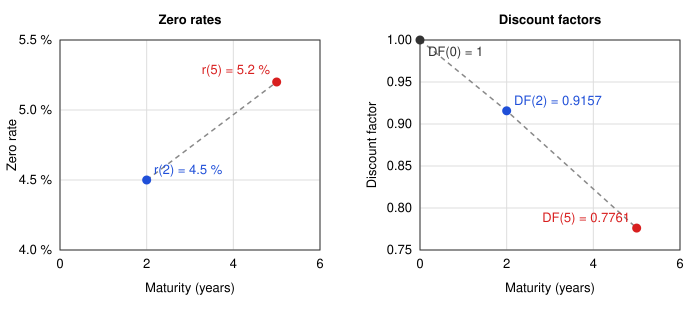

# Interest Rate Curves Fundamentals

## Structure of interest rates

The **structure of interest rates** describes the relation between interest rates and their **tenors**. The tenor is the time to maturity of a fixed income instrument. Each instrument a has its own interest rate, and this rate could depend on the tenor of the instrument. For example, in normal market conditions a longer instrument usually pays a higher interest rate. The main reasons are:

- **Term premium (liquidity preference):** the lender locks the capital for a longer time and is exposed to more uncertainty, so the lender asks for a compensation.
- **Expectations of future short rates:** the long rate reflects the expected path of the short rates. If the market expects rate cuts, the long rate can be lower than the short rate.
- **Inflation risk:** the purchasing power of a fixed payment far in the future is more uncertain, so the lender asks for a higher rate.
- **Credit risk:** for the same borrower, the probability of a default grows with the time horizon, so the long rate includes a larger credit spread.
- **Interest rate risk (price sensitivity):** the price of a long instrument moves more when the rates change, so the investor asks for a compensation for this volatility.
- **Market segmentation (preferred habitat):** different investors prefer different tenors, for example banks prefer short tenors and pension funds prefer long tenors. Supply and demand in each segment set the rate of that tenor.

The **curve** is the graph of this structure. It shows the tenor on the horizontal axis and the interest rate on the vertical axis. EaSpot Curve or ch point is the rate of one tenor. The curve is not always upward sloping. It can be flat or inverted when the market expects lower rates in the future, as in the US Treasury market in 2022 and 2023.

## Yield Curve

The **yield curve** is usually the curve of the yields of a set of bonds of the same issuer and the same credit quality, plotted against their tenors. The yield of a bond is its **yield to maturity(YTM)** the single rate that makes the present value of all the coupons and of the principal equal to the market price of the bond.

The market gives this curve almost directly. The market data are prices and quoted yields. A quoted yield already includes the market conventions of the instrument: the day-count rule and the compounding frequency. For example, the US Treasury market and the swap market use a semi-annual compounding. 

The yield curve has two limits:

- **The yield is an average.** One single rate discounts all the cash flows of the bond. The yield mixes the rates of all the tenors up to the maturity.
- **The yield depends on the coupon.** Two bonds with the same maturity but different coupons have different yields. This effect is the **coupon effect**.

For these two reasons you cannot use a yield to discount one single cash flow. To discount cash flows you must use the zero curve of the next section. The **bootstrap** procedure extracts the zero curve from the market instruments.

## Spot rates/Zero rates

The zero rate for maturity $T$ is the interest rate of a zero-coupon bond that matures at $T$. The bond pays no coupon, the only cash flow is the principal at maturity. There is one zero rate for each maturity, and together they form the zero curve.

**Example**

Zero rates:

- Zero rate at 2 years: $r(2) = 4.5\,\%$
- Zero rate at 5 years: $r(5) = 5.2\,\%$

Discount factors:

- $DF(2) = \frac{1}{(1.045)^2} = 0.9157$
- $DF(5) = \frac{1}{(1.052)^5} = 0.7761$

The chart shows the two points of the example. The left panel gives the zero rates. The right panel gives the discount factors.

Usually the zero rate grows with the maturity, but the discount factor falls.

## Forward Rates

TODO

## Par Rates

TODO

## Fundamental Relations Between Curves