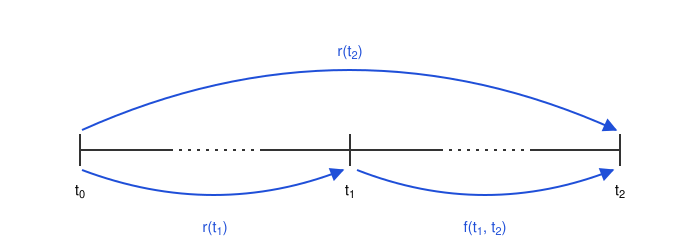

# Interest Rate Curves Fundamentals

## Structure of interest rates

The **structure of interest rates** describes the relation between interest rates and their **tenors**. The tenor is the time to maturity of a fixed income instrument. Each instrument a has its own interest rate, and this rate could depend on the tenor of the instrument. For example, in normal market conditions a longer instrument usually pays a higher interest rate. The main reasons are:

- **Term premium (liquidity preference):** the lender locks the capital for a longer time and is exposed to more uncertainty, so the lender asks for a compensation.
- **Expectations of future short rates:** the long rate reflects the expected path of the short rates. If the market expects rate cuts, the long rate can be lower than the short rate.
- **Inflation risk:** the purchasing power of a fixed payment far in the future is more uncertain, so the lender asks for a higher rate.
- **Credit risk:** for the same borrower, the probability of a default grows with the time horizon, so the long rate includes a larger credit spread.
- **Interest rate risk (price sensitivity):** the price of a long instrument moves more when the rates change, so the investor asks for a compensation for this volatility.
- **Market segmentation (preferred habitat):** different investors prefer different tenors, for example banks prefer short tenors and pension funds prefer long tenors. Supply and demand in each segment set the rate of that tenor.

The **curve** is the graph of this structure. It shows the tenor on the horizontal axis and the interest rate on the vertical axis. EaSpot Curve or ch point is the rate of one tenor. The curve is not always upward sloping. It can be flat or inverted when the market expects lower rates in the future, as in the US Treasury market in 2022 and 2023.

## Yield Curve

The **yield curve** is usually the curve of the yields of a set of bonds of the same issuer and the same credit quality, plotted against their tenors. The yield of a bond is its **yield to maturity(YTM)** the single rate that makes the present value of all the coupons and of the principal equal to the market price of the bond.

The market gives this curve almost directly. The market data are prices and quoted yields. A quoted yield already includes the market conventions of the instrument: the day-count rule and the compounding frequency. For example, the US Treasury market and the swap market use a semi-annual compounding. 

The yield curve has two limits:

- **The yield is an average.** One single rate discounts all the cash flows of the bond. The yield mixes the rates of all the tenors up to the maturity.
- **The yield depends on the coupon.** Two bonds with the same maturity but different coupons have different yields. This effect is the **coupon effect**.

For these two reasons you cannot use a yield to discount one single cash flow. To discount cash flows you must use the zero curve of the next section. The **bootstrap** procedure extracts the zero curve from the market instruments.

## Spot rates/Zero rates

The zero rate for maturity $T$ is the interest rate of a zero-coupon bond that matures at $T$. The bond pays no coupon, the only cash flow is the principal at maturity. There is one zero rate for each maturity, and together they form the zero curve.

**Example**

Zero rates:

- Zero rate at 2 years: $r(2) = 4.5\,\%$
- Zero rate at 5 years: $r(5) = 5.2\,\%$

Discount factors:

- $DF(2) = \frac{1}{(1.045)^2} = 0.9157$
- $DF(5) = \frac{1}{(1.052)^5} = 0.7761$

The chart shows the two points of the example. The left panel gives the zero rates. The right panel gives the discount factors.

Usually the zero rate grows with the maturity, but the discount factor falls.

## Par Rates

A par rate curve is a curve that measures the yield of fixed income instruments quoted at par price. Each rate in the curve is the rate that an instrument needs to have to be quoted at par price. When we say that an instrument is quoted at par, we say that the instrument is quoted at its nominal or issue value. Usually, in bonds, the par price is 100.

**Example**

Consider a bond with a par value of 100, annual coupons $C$, and a maturity of 3 years. The bond is quoted at par when the present value of its cash flows, discounted with the zero rates, is equal to 100:

$$\frac{C}{1 + r(1)} + \frac{C}{(1 + r(2))^2} + \frac{C + 100}{(1 + r(3))^3} = 100$$

The coupon $C$ that solves this equation, divided by the par value, is the 3-year par rate.

## Forward Rates

A forward rate $f(t_1, t_2)$ is the interest rate for a future period that starts at $t_1$ and ends at $t_2$. The market does not quote this rate directly. It is implicit in the current spot curve, and you deduce it from the zero rates.

A spot rate is agreed today for a loan that starts today. A forward rate is also agreed today, but for a loan that starts in the future. The forward rate is implied by the spot curve of today, not by a forecast of future spot rates.

$$f(t_1, t_2) = \left( \frac{(1 + r(t_2))^{t_2}}{(1 + r(t_1))^{t_1}} \right)^{\frac{1}{t_2 - t_1}} - 1$$

**Example** 

We define different interest rates for different tenors:

 - r(1): 3.0%
 - r(2): 4.0%
 - r(3): 4.5%

Forward 1y1y: $f(1,2) = \frac{(1 + 0.04)^{2}}{(1 + 0.03)} - 1 = 5.01\%$

Forward 2y1y: $f(2,3) = \frac{(1 + 0.045)^{3}}{(1 + 0.04)^2}  - 1 = 5.51\%$

**Derivation**

The no-arbitrage condition gives the relation. Let $t_0 = 0$ be today. An investment from $t_0$ to $t_2$ must give the same result as an investment from $t_0$ to $t_1$ and then from $t_1$ to $t_2$ at the forward rate. Consider the spot curve represented by the following timeline:

Applying the no-arbitrage condition:

$$C_0(1+r(t_2))^{t_2} = C_0(1+r(t_1))^{t_1}(1+f(t_1,t_2))^{t_2-t_1}$$

Therefore:

$$(1+r(t_2))^{t_2} = (1+r(t_1))^{t_1}(1+f(t_1,t_2))^{t_2-t_1}$$

We can isolate $f(t_1,t_2)$:

$$f(t_1,t_2) = \left [ \frac{(1+r(t_2))^{t_2}}{(1+r(t_1))^{t_1}} \right ]^{\frac{1}{t_2-t_1}} - 1$$

## Bootstrapping 

In the market we cannot observe directly the interest rates curves, what we see are different fixed income instruments that are quoted in the market at different prices. Bootstrapping is the process of building a zero curve from the market prices of such instruments. 

The method is sequential. You sort the instruments by maturity, from the shortest to the longest. For each instrument, you use the zero rates that you already know to solve for the one unknown zero rate at its maturity. A coupon bond with maturity $T$ gives the zero rate at $T$, because the zero rates of its earlier coupon dates are already known.

The no-arbitrage condition requires that the theoretical price equals the market price. The same condition also fixes the rate that discounts each cash flow, a cash flow at time $t_i$ must be discounted with the zero rate of that date, $r(t_i)$.

For an instrument with price $P$ and cash flows $C_i$ at times $t_i$:

$$P = \sum_{i=1}^{n} \frac{C_i}{(1 + r(t_i))^{t_i}}$$

Only $r(t_n)$ is unknown in this equation. The procedure is:

1. **Shortest maturity:** Compute the zero rate directly from the instrument that pays $C_1 + P_1$ at $t_1$ and costs $P_0$ today:

   $$r(t_1) = \frac{C_1 + P_1}{P_0} - 1$$

2. **Next maturities:** Write the price equation of the next instrument with the known zero rates.
3. **Iteration:** Solve the price equation for the unknown $r(T)$ and repeat for the next maturity.
4. **Verification:** Check that the zero curve reproduces the market prices of all the instruments.

**Example**

The market quotes three instruments. The deposit gives the first zero rate directly. The two swaps are quoted at par, so the price of each swap equals its notional.

| Instrument | Maturity | Coupon | Price | Zero Rate |
| ---------- | -------- | ------ | ----- | --------- |
| Deposit    | 1Y       | -      | -     | 3.00 %    |
| Bond 1     | 2Y       | 4.20 % | par   | ?         |
| Bond 2     | 3Y       | 4.60 % | par   | ?         |

- For the Deposit we already know the Zero Rate

- For the Bond 1 we have to compute the YTM for the instrument quoted at par (100$):

$$100\$ = \frac{4.2\$}{(1+0.03)} + \frac{104.2\$}{(1+r(2Y))^2}$$

  We isolate $r(2Y)$:

$$(1+r(2Y))^2 = \frac{104.2\$}{100\$ - \frac{4.2\$}{1.03}} \quad \Rightarrow \quad r(2Y) = \sqrt{\frac{104.2}{100 - \frac{4.2}{1.03}}} - 1 \approx 0.042255 = 4.21 \%$$

- For the Bond 2 we have to compute the YTM for the instrument quoted at par (100$):

$$100\$ = \frac{4.6\$}{(1+0.03)} + \frac{4.6\$}{(1+0.0421)^2} + \frac{104.6\$}{(1+r(3Y))^3}$$

  We isolate $r(3Y)$:

$$(1+r(3Y))^3 = \frac{104.6\$}{100\$ - \frac{4.6\$}{1.03} - \frac{4.6\$}{(1.0421)^2}} \quad \Rightarrow \quad r(3Y) = \sqrt[3]{\frac{104.6}{100 - \frac{4.6}{1.03} - \frac{4.6}{(1.0421)^2}}} - 1 \approx 0.046381 = 4.64 \%$$

## Carry and Roll-Down

The **Carry** is the yield obtained by keeping a position with the yield to maturity of the instrument unchanged. It comes from the coupon income and from the "pull to par" effect: as time passes, an instrument price moves toward its par value, apart from any move in the yield curve.

The **Roll-Down** is the extra profit or loss that an instrument accrues, on an unchanged yield curve, because a different point of the curve applies to it as time passes. As an instrument moves toward maturity, it has less time to maturity, so a different point of the same yield curve applies to it. If this new yield is lower, the instrument price rises and the investor gains.

**Carry**:

$$Carry = \frac{Coupon + Amortization}{P_{initial}}$$

The Amortization is the price change that comes only from the passage of time, with the yield of the instrument unchanged. It is the yearly part of the "pull to par", positive for a bond bought below par (discount) and negative for a bond bought above par (premium).

**Roll-Down**:

$$Roll\text{-}Down = \frac{P_{new} - P_{initial} - Amortization}{P_{initial}}$$

The Roll-Down formula subtracts the Amortization because the Carry already contains the "pull to par". It measures only the extra price change from the new, lower point of the curve, so Carry + Roll-Down is the total return on a static curve.

**Total Return**:

$$Total = Carry + Roll\text{-}Down = \frac{P_{new} - P_{initial} + Coupon}{P_{initial}}$$

**Example**

Situation: a 5-year bond, coupon 5.0 %, price 102.19$, yield 4.5 %.

Initial data ($t=0$):

- Price: 102.19$
- Yield: 4.5 %
- Annual coupon: 5%
- Maturity: 5 years

After 1 year ($t=1$):

- New maturity: 4 years
- Yield 4Y (static curve): 4.3 %
- New price: 102.52$
- Coupon received: 5.0

Carry:

$$Amortization = \frac{5\$}{(1+0.045)} + \frac{5\$}{(1+0.045)^2} + \frac{5\$}{(1+0.045)^3} + \frac{105\$}{(1+0.045)^4} - 102.19\$ = 101.79\$ - 102.19\$ = -0.40\$$$

$$Carry = \frac{5\$ - 0.40\$}{102.19\$} = 4.50\%$$

Roll-Down:

$$Roll\text{-}Down = \frac{102.52\$ - 102.19\$ - (-0.40\$)}{102.19\$} = \frac{102.52\$ - 101.79\$}{102.19\$} = 0.71\%$$

Total Return:

$$Total = Carry + Roll\text{-}Down = 4.50\% + 0.71\% = 5.21\%$$

Of the total return, 4.50 % comes from the coupon and the "pull to par" (Carry), and 0.71 % comes from the move to the lower 4-year point of the static curve (Roll-Down).
