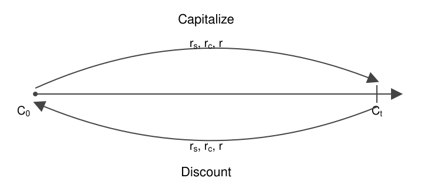

# Capitalization Process

## Definitions

### Capitalization

The capitalization is the process where an investor invests an initial capital with the goal to generate interest in the future. An investor gives an initial capital $C_0$ at the present time. The investor receives a larger capital $C_t$ at a future time $t$. The difference $I = C_t - C_0$ is the interest. The interest is the price of the use of the money during the term $t$.

Notation:

- $C_0$: initial capital (present value).
- $C_t$: accumulated capital or future value at time $t$.
- $t$: term or elapsed time, in years.
- $m$: number of capitalization periods per year (compounding frequency).
- $r_s$: simple interest rate.
- $r_c$: compound interest rate.
- $r$: continuous interest rate.

### Discount

The discount is the inverse process of the capitalization. It determines the present value $C_0$ of a capital $C_t$ that an investor receives or pays at a future time $t$. The present value is the future capital minus the interest that the capital would produce during the term $t$. The difference $D = C_t - C_0$ is the discount.

> It answers the following question: "Which capital $C_0$ must I invest in the present to obtain a specific capital $C_t$ in the future?"

## Simple Capitalization

In the simple capitalization we always compute the interests over the initial capital, the generated interest is not re-invested.

The formula of simple capitalization:

$C_t = C_0 (1 + r_s t)$

The formula of simple discount:

$C_0 = \frac{C_t}{1 + r_s t}$

> The discount formula is the capitalization formula solved for $C_0$. The factor $(1 + r_s t)$ is the growth factor of the capital during the term $t$. Capitalization multiplies the present capital by this factor to move it forward in time. Discount divides the future capital by the same factor to move it back in time. The division undoes the growth, so $C_0$ is the amount that grows exactly to $C_t$.

## Compound Capitalization

In the compound capitalization, the interest is reinvested at the end of each period. The reinvested interest becomes part of the capital. In the next period, the interest is computed on this larger capital. The interest generates more interest, so the capital grows in an exponential way with the term $t$.

The formula of compound capitalization:

$C_t = C_0 (1 + \frac{r_c}{m})^{mt}$

The formula of compound discount:

$C_0 = \frac{C_t}{(1 + \frac{r_c}{m})^{mt}}$

> The rate $r_c$ is usually defined as the nominal annual rate, so the rate of one period is $r_c / m$. Each year contains $m$ periods, and the term contains $t$ years. Therefore the term contains $m \cdot t$ periods in total.

### Compound Capitalization Proof

In compound capitalization, at the end of each period, the capital receives interest equal to $\frac{r_c}{m}$ times the current capital. If we define the compound capitalization as $f(mt)$, where $t$ is the time in years and $m$ is the number of compoundings per year (the unit of $m$ is years$^{-1}$), we observe a recursive behavior:

$f(mt)|_{t=0} = C_0$

$f(mt)|_{t=\frac{1}{m}}= C_0 +  C_0 \frac{r_c}{m} = C_0 (1 + \frac{r_c}{m})$

$f(mt)|_{t=\frac{2}{m}} = C_0 +  C_0 \frac{r_c}{m} + (C_0 +  C_0 \frac{r_c}{m})\frac{r_c}{m} = C_0 (1 + \frac{r_c}{m})(1 + \frac{r_c}{m}) =  C_0 (1 + \frac{r_c}{m})^2$

$\vdots$

Let $n = mt$, where $n$ is the number of compoundings in the period of capitalization (years times the number of compoundings per year). By definition, for $n \in \mathbb{N}$, $n \geq 1$:

$f(mt) = f(m(t - \frac{1}{m})) + f(m(t - \frac{1}{m})) \frac{r_c}{m} = f(m(t - \frac{1}{m})) (1 + \frac{r_c}{m})$

In terms of $n$:

$f(n) = f(n-1)(1 + \frac{r_c}{m})$

Assume, for some $n \geq 1$:

$f(n-1) = C_0(1 + \frac{r_c}{m})^{n-1}$.

Then:

$f(n) = f(n-1)(1 + \frac{r_c}{m}) = C_0(1 + \frac{r_c}{m})^{n-1}(1 + \frac{r_c}{m}) = C_0(1 + \frac{r_c}{m})^n$.

With $f(0) = C_0$ as base case, the formula holds for all $n \in \mathbb{N}$ by induction.

Therefore, for all $t \geq 0$ such that $mt \in \mathbb{N}$:

$C_t = f(mt) = C_0 (1 + \frac{r_c}{m})^{mt}$
