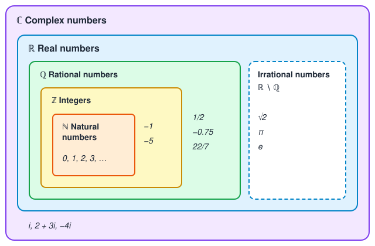

# Sentential Logic

> **Sentential** (adjective): of or related to a sentence. In logic, sentential logic (also called propositional logic) studies whole sentences and the logical connectives that combine them, not the internal structure of the sentences.

## 1.1 Deductive Reasoning and Logical Connectives

Deductive reasoning is the foundation on which proofs are based. We arrive at a **conclusion** from the assumption that some other statements, called **premises**, are true.

We will say that an argument is valid if the premises cannot all be true without the conclusion being true as well.

If an argument has the form:

- $P$ or $Q$.
- Not $Q$.
- Therefore, $P$.

It is this form, and not the subject matter, that makes this argument valid. Replacing certain statements in each argument with letters has two advantages. First, it keeps us from being distracted by aspects of the arguments that don't affect their validity. Second, you can tell that this argument form is valid without even knowing what $P$ and $Q$ stand for.

In most deductive reasoning, and in particular in mathematical reasoning, the meanings of just a few words give us the key to understanding what makes a piece of reasoning valid or invalid.

**Connective symbols** stand for some of the words used to combine statements. The first three connective symbols to introduce, and the words they stand for, are:

| Symbol | Word | Name        |
| ------ | ---- | ----------- |
| ∨      | or   | disjunction |
| ∧      | and  | conjunction |
| ¬      | not  | negation    |

Thus, if $P$ and $Q$ stand for two statements, then we will write $P \lor Q$ to stand for the statement "$P$ or $Q$", $P \land Q$ for "$P$ and $Q$", and $\neg P$ for "not $P$" or "$P$ is false".

The symbols ∧ and ∨ can only be used between two statements, to form their conjunction or disjunction, and the symbol ¬ can only be used before a statement, to negate it. This means that certain strings of letters and symbols are simply meaningless. For example, P ¬ ∧ Q, P ∧ ∨ Q and P ¬ are all "ungrammatical" expressions in the language of logic. "Grammatical" expressions are sometimes called **well-formed** formulas or just **formulas**.

### Exercises

**5\.** Which of the following expressions are well-formed formulas?

**a)** $\neg(\neg P \lor \neg\neg R)$ — ✅ Well-formed formula.

**b)** $\neg(P, Q, \land R)$ — ❌ Invalid formula.

**c)** $P \land \neg P$ — ✅ Well-formed formula.

**d)** $(P \land Q)(P \lor R)$ — ❌ Invalid formula.

**6\.** Identify the premises and conclusions of the following deductive arguments and analyze their logical forms. Do you think the reasoning is valid?

**a)** Jane and Pete won't both win the math prize. Pete will win either the math prize or the chemistry prize. Jane will win the math prize. Therefore, Pete will win the chemistry prize.

<u>**Premises**</u>

$\neg(J_m \land P_m)$

$P_m \lor P_c$

$J_m$

<u>**Conclusion**</u>

Pete will win the chemistry prize. $P_c$

The reasoning is valid, and the conclusion holds true. Jane won the math prize, which implies that Pete did not. So if Pete did not win the math prize, he won the chemistry prize.

**b)** The main course will be either beef or fish. The vegetable will be either peas or corn. We will not have both fish as a main course and corn as a vegetable. Therefore, we will not have both beef as a main course and peas as a vegetable.

<u>**Premises**</u>

$B \lor F$

$P \lor C$

$\neg (F \land C)$

<u>**Conclusion**</u>

We will not have both beef as a main course and peas as a vegetable. $\neg (B \land P)$

The reasoning is invalid and the conclusion does not hold, as none of the premises enforces that if we have beef as a main course we cannot have peas as a vegetable, we can have either peas or corn.

**c)** Either John or Bill is telling the truth. Either Sam or Bill is lying. Therefore, either John is telling the truth or Sam is lying.

<u>**Premises**</u>

$J \lor B$

$\neg S \lor \neg B$

<u>**Conclusion**</u>

$J \lor \neg S$

Either John is telling the truth or Sam is lying $J \lor \neg S$

The reasoning is valid, and the conclusion holds true as if John tells the truth it means that Bill is lying, and if Bill lies Sam cannot lie.

**d)** Either sales will go up and the boss will be happy, or expenses will go up and the boss won't be happy. Therefore, sales and expenses will not both go up.

<u>**Premises**</u>

$(S \land B) \lor (E \land \neg B)$

<u>**Conclusion**</u>

Sales and expenses will not both go up $\neg (S \land E)$

The reasoning is invalid and the conclusion does not hold, as the premises allow both sales and expenses to go up, they only constrain whether the boss is happy or not in that situation.

## 1.2 Truth Tables

When we evaluate the truth or falsity of a statement, we assign to it one of the labels **true** or **false**, and this label is called its **truth value**. For a set of statements we can summarize all the possibilities of their truth values in a table. This is called a truth table.

Each row of the truth table represents one possible combination of truth values for the statements.

For example, this is the truth table of the conjunction $P \land Q$:

| $P$ | $Q$ | $P \land Q$ |
| --- | --- | ----------- |
| T   | T   | T           |
| T   | F   | F           |
| F   | T   | F           |
| F   | F   | F           |

The truth table for $P \lor Q$ is a little trickier. Should $P \lor Q$ be true or false in the case in which $P$ and $Q$ are both true? Does $P \lor Q$ mean "$P$ or $Q$, or both" or does it mean "$P$ or $Q$, but not both"? The first way of interpreting the word or is called the **inclusive** or, and the second is called the **exclusive** or. In mathematics, or always means inclusive or, unless specified otherwise, so we will interpret $\lor$ as inclusive or.

This is the truth table of the disjunction $P \lor Q$:

| $P$ | $Q$ | $P \lor Q$ |
| --- | --- | ---------- |
| T   | T   | T          |
| T   | F   | T          |
| F   | T   | T          |
| F   | F   | F          |

A way of making truth tables more compactly. Instead of using separate columns to list the truth values of the component parts of a formula, just list those truth values below the corresponding connective symbol in the original formula.

For example, this is the compact truth table of $\neg(P \lor \neg Q)$. The column below $\neg Q$ shows the negation of $Q$, the column below $\lor$ shows $P \lor \neg Q$, and the column below the first $\neg$ shows the truth value of the whole formula:

| $P$ | $Q$ |     | $\neg$ | $(P$ | $\lor$ | $\neg$ | $Q)$ |
| --- | --- | --- | ------ | ---- | ------ | ------ | ---- |
| T   | T   |     | F      | T    | T      | F      | T    |
| T   | F   |     | F      | T    | T      | T      | F    |
| F   | T   |     | T      | F    | F      | F      | T    |
| F   | F   |     | F      | F    | T      | T      | F    |

Truth tables can be used for the analysis of the validity of arguments. We need to represent in the truth table the premises and the conclusion of the argument. Recall that an argument is valid if the premises cannot all be true without the conclusion being true as well.

**Example 1.2.3.1** Consider the following argument. Either John isn't smart and he is lucky, or he's smart. John is smart. Therefore, John isn't lucky. We let $S$ stand for "John is smart" and $L$ stand for "John is lucky". Then the argument has the form:

$$
\begin{array}{l}
(\neg S \land L) \lor S \\
S \\
\hline
\therefore \neg L
\end{array}
$$

> [!NOTE]
> The symbol $\therefore$ means "therefore".

If we build the truth table of this argument for both premises and the conclusion

| $S$ | $L$ |     | $(\neg$ | $S$ | $\land$ | $L)$ | $\lor$ | $S$ |     | $S$   |     | Conclusion ($\neg L$) |
| --- | --- | --- | ------- | --- | ------- | ---- | ------ | --- | --- | ----- | --- | --------------------- |
| F   | F   |     | T       | F   | F       | F    | **F**  | F   |     | **F** |     | T                     |
| F   | T   |     | T       | F   | T       | T    | **T**  | F   |     | **F** |     | F                     |
| T   | F   |     | F       | T   | F       | F    | **T**  | T   |     | **T** |     | T                     |
| T   | T   |     | F       | T   | F       | T    | **T**  | T   |     | **T** |     | F                     |

Both premises are true in lines three and four of this table. The conclusion is also true in line three, but it is false in line four. Thus, it is possible for both premises to be true and the conclusion false, so the argument is invalid. In fact, the table shows us exactly why the argument is invalid. The problem occurs in the fourth line of the table, in which $S$ and $L$ are both true (John is both smart and lucky). Thus, if John is both smart and lucky, then both premises will be true but the conclusion will be false, so it would be a mistake to infer that the conclusion must be true from the assumption that the premises are true. From the two premises, it clearly doesn't follow that John is not lucky, because he might be both smart and lucky.

Notice here that the truth table of the formula $(\neg S \land L) \lor S$ is exactly the same as the truth table for the simpler formula $L \lor S$. Because of this, we say that the formulas $(\neg S \land L) \lor S$ and $L \lor S$ are **equivalent**. Equivalent formulas always have the same truth value no matter what statements the letters in them stand for and no matter what the truth values of those statements are.

**Example 1.2.3.2** Let $B$ stand for the statement "The butler is innocent," $C$ for the statement "The cook is innocent," and $L$ for the statement "The butler is lying." Then the argument has the form:

$$
\begin{array}{l}
\neg ( B \land C)\\
L \lor C \\
\hline
\therefore L \lor \neg B
\end{array}
$$

If we build the truth table of this argument for both premises and the conclusion:

| $B$ | $C$ | $L$ |     | $\neg$ | $(B$ | $\land$ | $C)$ |     | $L$ | $\lor$ | $C$ |     | Conclusion ($L \lor \neg B$) |
| --- | --- | --- | --- | ------ | ---- | ------- | ---- | --- | --- | ------ | --- | --- | ---------------------------- |
| F   | F   | F   |     | **T**  | F    | F       | F    |     | F   | **F**  | F   |     | T                            |
| F   | F   | T   |     | **T**  | F    | F       | F    |     | T   | **T**  | F   |     | T                            |
| F   | T   | F   |     | **T**  | F    | F       | T    |     | F   | **T**  | T   |     | T                            |
| F   | T   | T   |     | **T**  | F    | F       | T    |     | T   | **T**  | T   |     | T                            |
| T   | F   | F   |     | **T**  | T    | F       | F    |     | F   | **F**  | F   |     | F                            |
| T   | F   | T   |     | **T**  | T    | F       | F    |     | T   | **T**  | F   |     | T                            |
| T   | T   | F   |     | **F**  | T    | T       | T    |     | F   | **T**  | T   |     | F                            |
| T   | T   | T   |     | **F**  | T    | T       | T    |     | T   | **T**  | T   |     | T                            |

Both premises are true in lines two, three, four, and six of this table, and the conclusion is also true in each of those lines. Thus, it is not possible for both premises to be true and the conclusion false, so the argument is valid.

### Logical Equivalences

**De Morgan's laws**

$$\neg(P \land Q) \equiv \neg P \lor \neg Q$$
$$\neg(P \lor Q) \equiv \neg P \land \neg Q$$

**Commutative laws**

$$P \land Q \equiv Q \land P$$
$$P \lor Q \equiv Q \lor P$$

**Associative laws**

$$P \land (Q \land R) \equiv (P \land Q) \land R$$
$$P \lor (Q \lor R) \equiv (P \lor Q) \lor R$$

**Idempotent laws**

$$P \land P \equiv P$$
$$P \lor P \equiv P$$

**Distributive laws**

$$P \land (Q \lor R) \equiv (P \land Q) \lor (P \land R)$$
$$P \lor (Q \land R) \equiv (P \lor Q) \land (P \lor R)$$

**Absorption laws**

$$P \lor (P \land Q) \equiv P$$
$$P \land (P \lor Q) \equiv P$$

**Double negation law**

$$\neg\neg P \equiv P$$

Many of the equivalences in the list should remind you of similar rules involving +, *, and - in algebra. As in algebra, these rules can be applied to more complex formulas, and they can be combined to work out more complicated equivalences. Any of the letters in these equivalences can be replaced by more complicated formulas, and the resulting equivalence will still be true.

### Tautology and Contradictions

Formulas that are always true, such as $P \lor \neg P$, are called **tautologies**. Similarly, formulas that are always false are called **contradictions**. For example, $P \land \neg P$ is a contradiction.

**Example 1.2.6** Are these formulas tautologies, contradictions, or neither?

a)
$$P \lor (Q \lor \neg P)$$

We can simplify this formula to:

$$P \lor \neg P \lor Q$$

where $P \lor \neg P$ is a tautology as it always evaluates to true, then the entire formula is also a tautology as $True \lor Q$ always evaluates to true.

b)
$$P \land \neg (Q \lor \neg Q)$$

$Q \lor \neg Q$ is a tautology as it always evaluates to true, so the negation always evaluates to false. So the whole formula is a contradiction as it always evaluates to false.

c) 
$$P \lor \neg (Q \lor \neg Q)$$

$Q \lor \neg Q$ is a tautology as it always evaluates to true, so the negation always evaluates to false. The formula can be simplified to $P \lor False$, which always evaluates to $P$. Thus, the formula is neither a tautology nor a contradiction.

We can also draw the truth table for the three formulas:

| $P$ | $Q$ |     | $P \lor (Q \lor \neg P)$ |     | $P \land \neg (Q \lor \neg Q)$ |     | $P \lor \neg (Q \lor \neg Q)$ |
| --- | --- | --- | ------------------------ | --- | ------------------------------ | --- | ----------------------------- |
| F   | F   |     | T                        |     | F                              |     | F                             |
| F   | T   |     | T                        |     | F                              |     | F                             |
| T   | F   |     | T                        |     | F                              |     | T                             |
| T   | T   |     | T                        |     | F                              |     | T                             |

The table confirms the analysis: the first formula is always true (a tautology), the second formula is always false (a contradiction), and the third formula has the same truth values as $P$ (neither).

We can now state a few more useful laws involving tautologies and contradictions.

**Tautology laws**

$$P \land (\text{a tautology}) \equiv P$$
$$P \lor (\text{a tautology}) \text{ is a tautology}$$
$$\neg(\text{a tautology}) \text{ is a contradiction}$$

**Contradiction laws**

$$P \land (\text{a contradiction}) \text{ is a contradiction}$$
$$P \lor (\text{a contradiction}) \equiv P$$
$$\neg(\text{a contradiction}) \text{ is a tautology}$$

### Exercises

**3\.** In this exercise we will use the symbol $+$ to mean **exclusive or** (XOR). In other words, $P + Q$ means "$P$ or $Q$, but not both."

**a)** Make a truth table for $P + Q$.

| $P$ | $Q$ | $P + Q$ |
| --- | --- | ------- |
| F   | F   | F       |
| F   | T   | T       |
| T   | F   | T       |
| T   | T   | F       |

**b)** Find a formula using only the connectives $\land$, $\lor$, and $\neg$ that is equivalent to $P + Q$. Justify your answer with a truth table.

$$(P \lor Q) \land \neg(P \land Q)$$

| $P$ | $Q$ | $(P \lor Q) \land \neg(P \land Q)$ |
| --- | --- | ---------------------------------- |
| F   | F   | F                                  |
| F   | T   | T                                  |
| T   | F   | T                                  |
| T   | T   | F                                  |

**5\.** Some mathematicians use the symbol $\downarrow$ to mean **nor**. In other words, $P \downarrow Q$ means "neither $P$ nor $Q$."

**a)** Make a truth table for $P \downarrow Q$.

| $P$ | $Q$ | $P \downarrow Q$ |
| --- | --- | ---------------- |
| F   | F   | T                |
| F   | T   | F                |
| T   | F   | F                |
| T   | T   | F                |

**b)** Find a formula using only the connectives $\land$, $\lor$, and $\neg$ that is equivalent to $P \downarrow Q$.

$$ \neg (P \lor Q) \equiv \neg P \land \neg Q$$

**c)** Find formulas using only the connective $\downarrow$ that are equivalent to $\neg P$, $P \lor Q$, and $P \land Q$.

$$ \neg P \equiv P \downarrow P$$

$$ P \lor Q \equiv \neg ( P \downarrow Q) \equiv (P \downarrow Q) \downarrow (P \downarrow Q)$$

$$ P \land Q \equiv \neg(\neg P \lor \neg Q) \equiv \neg P \downarrow \neg Q \equiv ( P \downarrow P) \downarrow ( Q \downarrow Q)$$

**6\.** Some mathematicians write $P | Q$ to mean "$P$ and $Q$ are not both true." (This connective is called **nand**, and is used in the study of circuits in computer science.)

**a)** Make a truth table for $P | Q$.

| $P$ | $Q$ | $P \| Q$ |
| --- | --- | -------- |
| F   | F   | T        |
| F   | T   | T        |
| T   | F   | T        |
| T   | T   | F        |

**b)** Find a formula using only the connectives $\land$, $\lor$, and $\neg$ that is equivalent to $P | Q$.

$$ \neg ( P \land Q) \equiv \neg P \lor \neg Q$$

**c)** Find formulas using only the connective $|$ that are equivalent to $\neg P$, $P \lor Q$, and $P \land Q$.

$$ \neg P \equiv P | P$$

$$ P \lor Q \equiv \neg(\neg P \land \neg Q) \equiv \neg P | \neg Q \equiv (P | P) | (Q | Q)$$

$$ P \land Q \equiv \neg (P | Q) \equiv (P | Q) | (P | Q)$$

**13\.** Use the first De Morgan's law and the double negation law to determine the second De Morgan's law.

**1st De Morgan's law**

$$\neg(P \land Q) \equiv \neg P \lor \neg Q$$

**Double negation law**

$$\neg\neg P \equiv P$$

If we apply the 1st De Morgan's law and the double negation law to the following formula:

$$\neg (\neg P \land \neg Q ) \equiv \neg \neg P \lor \neg \neg Q  \equiv P \lor Q$$

Then we negate both sides and apply the double negation law again:

$$\neg P \land \neg Q \equiv \neg\neg(\neg P \land \neg Q) \equiv \neg(P \lor Q)$$

We obtain the 2nd De Morgan's law:

$$\neg(P \lor Q) \equiv \neg P \land \neg Q$$

**18\.** Suppose the conclusion of an argument is a tautology. What can you conclude about the validity of the argument? What if the conclusion is a contradiction? What if one of the premises is either a tautology or a contradiction?

> [!NOTE]
> An argument is valid if the premises cannot all be true without the conclusion being true as well. To determine the validity with a truth table, find the lines in which all the premises are true. If the conclusion is true in all of those lines, the argument is valid. If the conclusion is false in at least one of those lines, the argument is invalid.

If the conclusion of an argument is a tautology, it means that its formula always evaluates to true independently of the evaluation of any of its premises. Therefore the argument is valid, because the case where all the premises are true and the conclusion is false can never occur.

If the conclusion of an argument is a contradiction, it means that its formula always evaluates to false independently of the values of its premises. Nonetheless, the argument can still be valid, as what determines the validity is that the premises cannot all be true without the conclusion being true as well.

If any of the premises is a tautology, that premise can be simplified out of the argument as the validity of the argument will always depend on the other premises. If any of the premises is a contradiction, the argument is always valid, as the premises can never all be true.

### 1.3 Variables and Sets

In mathematical reasoning, it is often necessary to make statements about objects that are represented by letters called **variables**. To represent a statement, we sometimes use a single letter, such as $P$, and other times we write $P(x)$ to stress that the statement is about the variable $x$.

Statements involving variables can be combined using connectives, just like statements without variables.

**Example 1.3.1.1** Analyze the logical form of the statement "$x$ is a prime number, and either $y$ or $z$ is divisible by $x$".

We can let $P(x)$ stand for "$x$ is a prime number", $D(y, x)$ stand for "$y$ is divisible by $x$", and $D(z, x)$ stand for "$z$ is divisible by $x$". Therefore, the statement has the form $P(x) \land (D(y, x) \lor D(z, x))$.

If a statement contains variables, we can no longer describe the statement as being simply true or false. Its truth value might depend on the values of the variables involved. To deal with this complication, we will define **truth sets** for statements containing variables.

A **set** is a collection of objects. The objects in the collection are called **elements** of the set. The simplest way to specify a particular set is to list its elements between braces "${}$".

We use the symbol $\in$ to mean "is an element of". To say that an object is not an element of a specific set, we use the symbol $\notin$.

A set is completely determined once its elements have been specified. Thus, two sets that have exactly the same elements are always equal. Also, when a set is defined by listing its elements, all that matters is which objects are in the list of elements, not the order in which they are listed. An element can appear more than once in the list, and this does not change the set.

Thus, $\{3, 7, 14\}$, $\{14, 3, 7\}$, and $\{3, 7, 14, 7\}$ are three different names for the same set.

It may be impractical to define a set that contains a very large number of elements by listing all of its elements, and it would be impossible to give such a definition for a set that contains infinitely many elements. Sets are usually defined by spelling out the pattern that determines the elements of the set.

For example, we could define the set $P$ of all prime numbers as:

$$P = \{x \mid x \text{ is a prime number}\}$$

This is read "$P$ is equal to the set of all $x$ such that $x$ is a prime number", and it means that the elements of $P$ are the values of $x$ that make the statement "$x$ is a prime number" come out true. You should think of the statement "$x$ is a prime number" as an **elementhood test** for the set. Any value of $x$ that makes this statement come out true passes the test and is an element of the set. Anything else fails the test and is not an element. 

Note that $x$ is a bound variable in the statement $y \in \{x \mid x^2 \lt 9\}$, even though it is a free variable in the statement $x^2 \lt 9$. This last statement is a statement about $x$ that would be true for some values of $x$ and false for others. It is only when this statement is used inside the elementhood test notation that $x$ becomes a bound variable. We could say that the notation $\{x \mid \dots\}$ binds the variable $x$.

In general, the statement $y \in \{x \mid P(x)\}$ means the same thing as $P(y)$, which is a statement about $y$ but not $x$. Similarly, $y \notin \{x \mid P(x)\}$ means the same thing as $\lnot P(y)$.

The expression $\{x \mid P(x)\}$ is not a statement at all, it is a name for a set. It is important to make the distinction between expressions that are mathematical statements and expressions that are names for mathematical objects.

**Definition 1.3.4** The **truth set** of a statement $P(x)$ is the set of all values of $x$ that make the statement $P(x)$ true. In other words, it is the set defined by using the statement $P(x)$ as an elementhood test: $\{x \mid P(x)\}$.

Suppose that $A$ is the truth set of a statement $P(x)$. According to the definition of a truth set, this means that $A = \{x \mid P(x)\}$. For any object $y$, the statement $y \in \{x \mid P(x)\}$ means the same thing as $P(y)$. It follows that $y \in A$ means the same thing as $P(y)$. Thus, we see that in general, if $A$ is the truth set of $P(x)$, then to say that $y \in A$ means the same thing as saying $P(y)$.

**Example 1.3.5.2** What is the truth set of the statement "$n$ is an even prime number"?

$\{n \mid n \text{ is an even prime number}\}$. The only number that passes the elementhood test is $2$, so the set is $\{2\}$. Note that $2$ and $\{2\}$ are not the same: the first is a number and the second is a set whose only element is the number $2$.

When a statement contains free variables, it is often clear from context that these variables stand for objects of a particular kind. The set of all objects of this kind is called the **universe of discourse** for the statement, and we say that the variables range over this universe.

Certain sets come up often in mathematics as universes of discourse, and it is convenient to have fixed names for them. Here are a few of the most important ones:

- **Real numbers:** $\mathbb{R} = \{x \mid x \text{ is a real number}\}$.
- **Rational numbers:** $\mathbb{Q} = \{x \mid x \text{ is a rational number}\}$. A rational number is a real number that can be written as a fraction $p/q$, where $p$ and $q$ are integers and $q \neq 0$.
- **Integers:** $\mathbb{Z} = \{x \mid x \text{ is an integer}\} = \{\dots, -3, -2, -1, 0, 1, 2, 3, \dots\}$.
- **Natural numbers:** $\mathbb{N} = \{x \mid x \text{ is a natural number}\} = \{0, 1, 2, 3, \dots\}$. Mathematicians do not agree on whether $0$ is a natural number: some authors start $\mathbb{N}$ at $1$. In these notes, as in the book, $0$ is a natural number.
- **Irrational numbers:** $\{x \mid x \in \mathbb{R} \text{ and } x \notin \mathbb{Q}\}$, also written $\mathbb{R} \setminus \mathbb{Q}$. These are the real numbers that cannot be written as a fraction, such as $\sqrt{2}$ and $\pi$.
- **Complex numbers:** $\mathbb{C} = \{a + bi \mid a \in \mathbb{R} \text{ and } b \in \mathbb{R}\}$, where $i$ is a number such that $i^2 = -1$.

The diagram below shows how these sets contain each other. Every natural number is an integer, every integer is a rational number, every rational number is a real number, and every real number is a complex number. The irrational numbers are the part of $\mathbb{R}$ that is outside $\mathbb{Q}$.

The letters can be followed by a superscript $+$ or $-$ to indicate that only positive or negative numbers are to be included in the set. For example:

$$\mathbb{R}^+ = \{x \mid x \text{ is a positive real number}\}$$
$$\mathbb{Z}^- = \{x \mid x \text{ is a negative integer}\}$$

The choice of universe of discourse can sometimes make a difference. For example, consider the statement $x^2 \lt 9$. If the universe of discourse of this statement were $\mathbb{R}$, then its truth set would be $\{x \in \mathbb{R} \mid x^2 \lt 9\}$, or in other words, the set of all real numbers between $-3$ and $3$, exclusive. But if the universe of discourse were $\mathbb{Z}$, then its truth set would be $\{x \in \mathbb{Z} \mid x^2 \lt 9\} = \{-2, -1, 0, 1, 2\}$.

Sometimes this explicit notation is used not to specify the universe of discourse but to restrict attention to just a part of the universe.

Because a set is completely determined once its elements have been specified, there is only one set that has no elements. It is called the **empty set**, or the **null set**, and is often denoted by $\emptyset$ or $\{\}$. For example, $\{x \in \mathbb{Z} \mid x \neq x\} = \emptyset$. Since the empty set has no elements, the statement $x \in \emptyset$ is always false.

