# 1 Sentential Logic

> **Sentential** (adjective): of or related to a sentence. In logic, sentential logic (also called propositional logic) studies whole sentences and the logical connectives that combine them, not the internal structure of the sentences.

## 1.1 Deductive Reasoning and Logical Connectives

Deductive reasoning is the foundation on which proofs are based. We arrive at a **conclusion** from the assumption that some other statements, called **premises**, are true.

We will say that an argument is valid if the premises cannot all be true without the conclusion being true as well.

Consider an argument of this form:

- $P$ or $Q$.
- Not $Q$.
- Therefore, $P$.

It is this form, and not the subject matter, that makes this argument valid. Replacing certain statements in each argument with letters has two advantages. First, it keeps us from being distracted by aspects of the arguments that don't affect their validity. Second, you can tell that this argument form is valid without even knowing what $P$ and $Q$ stand for.

In most deductive reasoning, and in particular in mathematical reasoning, the meanings of just a few words give us the key to understanding what makes a piece of reasoning valid or invalid.

**Connective symbols** stand for some of the words used to combine statements. The first three connective symbols that we introduce, and the words that they stand for, are:

| Symbol | Word | Name        |
| ------ | ---- | ----------- |
| ∨      | or   | disjunction |
| ∧      | and  | conjunction |
| ¬      | not  | negation    |

Thus, if $P$ and $Q$ stand for two statements, then we will write $P \lor Q$ to stand for the statement "$P$ or $Q$", $P \land Q$ for "$P$ and $Q$", and $\neg P$ for "not $P$" or "$P$ is false".

The symbols ∧ and ∨ can only be used between two statements, to form their conjunction or disjunction, and the symbol ¬ can only be used before a statement, to negate it. This means that certain strings of letters and symbols are simply meaningless. For example, $P \neg \land Q$, $P \land \lor Q$, and $P \neg$ are all "ungrammatical" expressions in the language of logic. "Grammatical" expressions are sometimes called **well-formed** formulas or just **formulas**.

### Exercises

**5\.** Which of the following expressions are well-formed formulas?

**a)** $\neg(\neg P \lor \neg\neg R)$ — ✅ Well-formed formula.

**b)** $\neg(P, Q, \land R)$ — ❌ Invalid formula.

**c)** $P \land \neg P$ — ✅ Well-formed formula.

**d)** $(P \land Q)(P \lor R)$ — ❌ Invalid formula.

**6\.** Identify the premises and conclusions of the following deductive arguments and analyze their logical forms. Do you think the reasoning is valid?

**a)** Jane and Pete won't both win the math prize. Pete will win either the math prize or the chemistry prize. Jane will win the math prize. Therefore, Pete will win the chemistry prize.

<u>**Premises**</u>

$\neg(J_m \land P_m)$

$P_m \lor P_c$

$J_m$

<u>**Conclusion**</u>

Pete will win the chemistry prize. $P_c$

The reasoning is valid. Jane will win the math prize, so the first premise tells us that Pete will not win it. Because Pete will win either the math prize or the chemistry prize, he will win the chemistry prize.

**b)** The main course will be either beef or fish. The vegetable will be either peas or corn. We will not have both fish as a main course and corn as a vegetable. Therefore, we will not have both beef as a main course and peas as a vegetable.

<u>**Premises**</u>

$B \lor F$

$P \lor C$

$\neg (F \land C)$

<u>**Conclusion**</u>

We will not have both beef as a main course and peas as a vegetable. $\neg (B \land P)$

The reasoning is invalid. None of the premises prevents us from having beef as a main course and peas as a vegetable. If we have beef and peas, with no fish and no corn, all three premises are true, but the conclusion is false.

**c)** Either John or Bill is telling the truth. Either Sam or Bill is lying. Therefore, either John is telling the truth or Sam is lying.

<u>**Premises**</u>

$J \lor B$

$\neg S \lor \neg B$

<u>**Conclusion**</u>

Either John is telling the truth or Sam is lying. $J \lor \neg S$

The reasoning is valid. If Bill is telling the truth, then the second premise tells us that Sam is lying, so the conclusion is true. If Bill is lying, then the first premise tells us that John is telling the truth, so the conclusion is true again.

**d)** Either sales will go up and the boss will be happy, or expenses will go up and the boss won't be happy. Therefore, sales and expenses will not both go up.

<u>**Premises**</u>

$(S \land B) \lor (E \land \neg B)$

<u>**Conclusion**</u>

Sales and expenses will not both go up. $\neg (S \land E)$

The reasoning is invalid. The premise allows both sales and expenses to go up. It only tells us whether the boss is happy in each case.

## 1.2 Truth Tables

When we evaluate the truth or falsity of a statement, we assign to it one of the labels **true** or **false**, and this label is called its **truth value**. For a set of statements, we can summarize all the possibilities of their truth values in a table. This is called a truth table.

Each row of the truth table represents one possible combination of truth values for the statements.

For example, this is the truth table of the conjunction $P \land Q$:

| $P$ | $Q$ | $P \land Q$ |
| --- | --- | ----------- |
| T   | T   | T           |
| T   | F   | F           |
| F   | T   | F           |
| F   | F   | F           |

The truth table for $P \lor Q$ is a little trickier. Should $P \lor Q$ be true or false in the case in which $P$ and $Q$ are both true? Does $P \lor Q$ mean "$P$ or $Q$, or both" or does it mean "$P$ or $Q$, but not both"? The first way of interpreting the word *or* is called the **inclusive** *or*, and the second is called the **exclusive** *or*. In mathematics, *or* always means inclusive *or*, unless specified otherwise, so we will interpret $\lor$ as inclusive *or*.

This is the truth table of the disjunction $P \lor Q$:

| $P$ | $Q$ | $P \lor Q$ |
| --- | --- | ---------- |
| T   | T   | T          |
| T   | F   | T          |
| F   | T   | T          |
| F   | F   | F          |

There is also a way to make truth tables more compact. Instead of using separate columns to list the truth values of the component parts of a formula, just list those truth values below the corresponding connective symbol in the original formula.

For example, this is the compact truth table of $\neg(P \lor \neg Q)$. The column below $\neg Q$ shows the negation of $Q$, the column below $\lor$ shows $P \lor \neg Q$, and the column below the first $\neg$ shows the truth value of the whole formula:

| $P$ | $Q$ |     | $\neg$ | $(P$ | $\lor$ | $\neg$ | $Q)$ |
| --- | --- | --- | ------ | ---- | ------ | ------ | ---- |
| T   | T   |     | F      | T    | T      | F      | T    |
| T   | F   |     | F      | T    | T      | T      | F    |
| F   | T   |     | T      | F    | F      | F      | T    |
| F   | F   |     | F      | F    | T      | T      | F    |

Truth tables can be used for the analysis of the validity of arguments. We need to represent in the truth table the premises and the conclusion of the argument. Recall that an argument is valid if the premises cannot all be true without the conclusion being true as well.

**Example 1.2.3.1** Consider the following argument. Either John isn't smart and he is lucky, or he's smart. John is smart. Therefore, John isn't lucky. We let $S$ stand for "John is smart" and $L$ stand for "John is lucky". Then the argument has the form:

$$
\begin{array}{l}
(\neg S \land L) \lor S \\
S \\
\hline
\therefore \neg L
\end{array}
$$

> [!NOTE]
> The symbol $\therefore$ means "therefore".

If we build the truth table of this argument for both premises and the conclusion:

| $S$ | $L$ |     | $(\neg$ | $S$ | $\land$ | $L)$ | $\lor$ | $S$ |     | $S$   |     | Conclusion ($\neg L$) |
| --- | --- | --- | ------- | --- | ------- | ---- | ------ | --- | --- | ----- | --- | --------------------- |
| F   | F   |     | T       | F   | F       | F    | **F**  | F   |     | **F** |     | T                     |
| F   | T   |     | T       | F   | T       | T    | **T**  | F   |     | **F** |     | F                     |
| T   | F   |     | F       | T   | F       | F    | **T**  | T   |     | **T** |     | T                     |
| T   | T   |     | F       | T   | F       | T    | **T**  | T   |     | **T** |     | F                     |

Both premises are true in lines three and four of this table. The conclusion is also true in line three, but it is false in line four. Thus, it is possible for both premises to be true and the conclusion false, so the argument is invalid. In fact, the table shows us exactly why the argument is invalid. The problem occurs in the fourth line of the table, in which $S$ and $L$ are both true (John is both smart and lucky). Thus, if John is both smart and lucky, then both premises will be true but the conclusion will be false, so it would be a mistake to infer that the conclusion must be true from the assumption that the premises are true. From the two premises, it clearly doesn't follow that John is not lucky, because he might be both smart and lucky.

Notice here that the truth table of the formula $(\neg S \land L) \lor S$ is exactly the same as the truth table for the simpler formula $L \lor S$. Because of this, we say that the formulas $(\neg S \land L) \lor S$ and $L \lor S$ are **equivalent**. Equivalent formulas always have the same truth value no matter what statements the letters in them stand for and no matter what the truth values of those statements are.

**Example 1.2.3.2** Let $B$ stand for the statement "The butler is innocent", $C$ for the statement "The cook is innocent", and $L$ for the statement "The butler is lying". Then the argument has the form:

$$
\begin{array}{l}
\neg ( B \land C)\\
L \lor C \\
\hline
\therefore L \lor \neg B
\end{array}
$$

If we build the truth table of this argument for both premises and the conclusion:

| $B$ | $C$ | $L$ |     | $\neg$ | $(B$ | $\land$ | $C)$ |     | $L$ | $\lor$ | $C$ |     | Conclusion ($L \lor \neg B$) |
| --- | --- | --- | --- | ------ | ---- | ------- | ---- | --- | --- | ------ | --- | --- | ---------------------------- |
| F   | F   | F   |     | **T**  | F    | F       | F    |     | F   | **F**  | F   |     | T                            |
| F   | F   | T   |     | **T**  | F    | F       | F    |     | T   | **T**  | F   |     | T                            |
| F   | T   | F   |     | **T**  | F    | F       | T    |     | F   | **T**  | T   |     | T                            |
| F   | T   | T   |     | **T**  | F    | F       | T    |     | T   | **T**  | T   |     | T                            |
| T   | F   | F   |     | **T**  | T    | F       | F    |     | F   | **F**  | F   |     | F                            |
| T   | F   | T   |     | **T**  | T    | F       | F    |     | T   | **T**  | F   |     | T                            |
| T   | T   | F   |     | **F**  | T    | T       | T    |     | F   | **T**  | T   |     | F                            |
| T   | T   | T   |     | **F**  | T    | T       | T    |     | T   | **T**  | T   |     | T                            |

Both premises are true in lines two, three, four, and six of this table, and the conclusion is also true in each of those lines. Thus, it is not possible for both premises to be true and the conclusion false, so the argument is valid.

### Logical Equivalences

**De Morgan's laws**

$$\neg(P \land Q) \equiv \neg P \lor \neg Q$$
$$\neg(P \lor Q) \equiv \neg P \land \neg Q$$

**Commutative laws**

$$P \land Q \equiv Q \land P$$
$$P \lor Q \equiv Q \lor P$$

**Associative laws**

$$P \land (Q \land R) \equiv (P \land Q) \land R$$
$$P \lor (Q \lor R) \equiv (P \lor Q) \lor R$$

**Idempotent laws**

$$P \land P \equiv P$$
$$P \lor P \equiv P$$

**Distributive laws**

$$P \land (Q \lor R) \equiv (P \land Q) \lor (P \land R)$$
$$P \lor (Q \land R) \equiv (P \lor Q) \land (P \lor R)$$

**Absorption laws**

$$P \lor (P \land Q) \equiv P$$
$$P \land (P \lor Q) \equiv P$$

**Double negation law**

$$\neg\neg P \equiv P$$

Many of the equivalences in the list should remind you of similar rules involving $+$, $\cdot$, and $-$ in algebra. As in algebra, these rules can be applied to more complex formulas, and they can be combined to work out more complicated equivalences. Any of the letters in these equivalences can be replaced by more complicated formulas, and the resulting equivalence will still be true.

### Tautologies and Contradictions

Formulas that are always true, such as $P \lor \neg P$, are called **tautologies**. Similarly, formulas that are always false are called **contradictions**. For example, $P \land \neg P$ is a contradiction.

**Example 1.2.6** Are these formulas tautologies, contradictions, or neither?

a)
$$P \lor (Q \lor \neg P)$$

With the commutative and associative laws, we can rewrite this formula as:

$$(P \lor \neg P) \lor Q$$

$P \lor \neg P$ is a tautology, because it always evaluates to true. Thus, the entire formula is also a tautology, because $\text{True} \lor Q$ always evaluates to true.

b)
$$P \land \neg (Q \lor \neg Q)$$

$Q \lor \neg Q$ is a tautology, because it always evaluates to true, so its negation always evaluates to false. Thus, the whole formula is a contradiction, because it always evaluates to false.

c)
$$P \lor \neg (Q \lor \neg Q)$$

$Q \lor \neg Q$ is a tautology, because it always evaluates to true, so its negation always evaluates to false. The formula can be simplified to $P \lor \text{False}$, which is equivalent to $P$. Thus, the formula is neither a tautology nor a contradiction.

We can also draw the truth table for the three formulas:

| $P$ | $Q$ |     | $P \lor (Q \lor \neg P)$ |     | $P \land \neg (Q \lor \neg Q)$ |     | $P \lor \neg (Q \lor \neg Q)$ |
| --- | --- | --- | ------------------------ | --- | ------------------------------ | --- | ----------------------------- |
| F   | F   |     | T                        |     | F                              |     | F                             |
| F   | T   |     | T                        |     | F                              |     | F                             |
| T   | F   |     | T                        |     | F                              |     | T                             |
| T   | T   |     | T                        |     | F                              |     | T                             |

The table confirms the analysis: the first formula is always true (a tautology), the second formula is always false (a contradiction), and the third formula has the same truth values as $P$ (neither).

We can now state a few more useful laws involving tautologies and contradictions.

**Tautology laws**

$$P \land (\text{a tautology}) \equiv P$$
$$P \lor (\text{a tautology}) \text{ is a tautology}$$
$$\neg(\text{a tautology}) \text{ is a contradiction}$$

**Contradiction laws**

$$P \land (\text{a contradiction}) \text{ is a contradiction}$$
$$P \lor (\text{a contradiction}) \equiv P$$
$$\neg(\text{a contradiction}) \text{ is a tautology}$$

### Exercises

**3\.** In this exercise, we will use the symbol $\oplus$ to mean **exclusive or** (XOR). In other words, $P \oplus Q$ means "$P$ or $Q$, but not both".

**a)** Make a truth table for $P \oplus Q$.

| $P$ | $Q$ | $P \oplus Q$ |
| --- | --- | ------------ |
| F   | F   | F            |
| F   | T   | T            |
| T   | F   | T            |
| T   | T   | F            |

**b)** Find a formula using only the connectives $\land$, $\lor$, and $\neg$ that is equivalent to $P \oplus Q$. Justify your answer with a truth table.

$$(P \lor Q) \land \neg(P \land Q)$$

| $P$ | $Q$ | $(P \lor Q) \land \neg(P \land Q)$ |
| --- | --- | ---------------------------------- |
| F   | F   | F                                  |
| F   | T   | T                                  |
| T   | F   | T                                  |
| T   | T   | F                                  |

**5\.** Some mathematicians use the symbol $\downarrow$ to mean **nor**. In other words, $P \downarrow Q$ means "neither $P$ nor $Q$".

**a)** Make a truth table for $P \downarrow Q$.

| $P$ | $Q$ | $P \downarrow Q$ |
| --- | --- | ---------------- |
| F   | F   | T                |
| F   | T   | F                |
| T   | F   | F                |
| T   | T   | F                |

**b)** Find a formula using only the connectives $\land$, $\lor$, and $\neg$ that is equivalent to $P \downarrow Q$.

$$\neg (P \lor Q) \equiv \neg P \land \neg Q$$

**c)** Find formulas using only the connective $\downarrow$ that are equivalent to $\neg P$, $P \lor Q$, and $P \land Q$.

$$\neg P \equiv P \downarrow P$$

$$P \lor Q \equiv \neg (P \downarrow Q) \equiv (P \downarrow Q) \downarrow (P \downarrow Q)$$

$$P \land Q \equiv \neg(\neg P \lor \neg Q) \equiv \neg P \downarrow \neg Q \equiv (P \downarrow P) \downarrow (Q \downarrow Q)$$

**6\.** Some mathematicians write $P | Q$ to mean "$P$ and $Q$ are not both true." (This connective is called **nand**, and is used in the study of circuits in computer science.)

**a)** Make a truth table for $P | Q$.

| $P$ | $Q$ | $P \| Q$ |
| --- | --- | -------- |
| F   | F   | T        |
| F   | T   | T        |
| T   | F   | T        |
| T   | T   | F        |

**b)** Find a formula using only the connectives $\land$, $\lor$, and $\neg$ that is equivalent to $P | Q$.

$$\neg (P \land Q) \equiv \neg P \lor \neg Q$$

**c)** Find formulas using only the connective $|$ that are equivalent to $\neg P$, $P \lor Q$, and $P \land Q$.

$$\neg P \equiv P | P$$

$$P \lor Q \equiv \neg(\neg P \land \neg Q) \equiv \neg P | \neg Q \equiv (P | P) | (Q | Q)$$

$$P \land Q \equiv \neg (P | Q) \equiv (P | Q) | (P | Q)$$

**13\.** Use the first De Morgan's law and the double negation law to derive the second De Morgan's law.

**First De Morgan's law**

$$\neg(P \land Q) \equiv \neg P \lor \neg Q$$

**Double negation law**

$$\neg\neg P \equiv P$$

If we apply the first De Morgan's law and the double negation law to the following formula:

$$\neg (\neg P \land \neg Q) \equiv \neg \neg P \lor \neg \neg Q \equiv P \lor Q$$

Then we negate both sides and apply the double negation law again:

$$\neg P \land \neg Q \equiv \neg\neg(\neg P \land \neg Q) \equiv \neg(P \lor Q)$$

We obtain the second De Morgan's law:

$$\neg(P \lor Q) \equiv \neg P \land \neg Q$$

**18\.** Suppose the conclusion of an argument is a tautology. What can you conclude about the validity of the argument? What if the conclusion is a contradiction? What if one of the premises is either a tautology or a contradiction?

> [!NOTE]
> An argument is valid if the premises cannot all be true without the conclusion being true as well. To determine the validity with a truth table, find the lines in which all the premises are true. If the conclusion is true in all of those lines, the argument is valid. If the conclusion is false in at least one of those lines, the argument is invalid.

If the conclusion of an argument is a tautology, its formula always evaluates to true, no matter what the truth values of the premises are. Therefore, the argument is valid, because the case where all the premises are true and the conclusion is false can never occur.

If the conclusion of an argument is a contradiction, its formula always evaluates to false, no matter what the truth values of the premises are. Thus, the argument is valid only if the premises can never all be true at the same time. In that case, there is no line in which all the premises are true and the conclusion is false.

If any of the premises is a tautology, we can remove that premise from the argument, because it is true in every line and the validity of the argument depends only on the other premises. If any of the premises is a contradiction, the argument is always valid, as the premises can never all be true.

## 1.3 Variables and Sets

In mathematical reasoning, it is often necessary to make statements about objects that are represented by letters called **variables**. To represent a statement, we sometimes use a single letter, such as $P$, and other times we write $P(x)$ to stress that the statement is about the variable $x$.

Statements involving variables can be combined using connectives, just like statements without variables.

**Example 1.3.1.1** Analyze the logical form of the statement "$x$ is a prime number, and either $y$ or $z$ is divisible by $x$".

We can let $P(x)$ stand for "$x$ is a prime number", $D(y, x)$ stand for "$y$ is divisible by $x$", and $D(z, x)$ stand for "$z$ is divisible by $x$". Therefore, the statement has the form $P(x) \land (D(y, x) \lor D(z, x))$.

If a statement contains variables, we can no longer describe the statement as being simply true or false. Its truth value might depend on the values of the variables involved. To deal with this complication, we will define **truth sets** for statements containing variables.

A **set** is a collection of objects. The objects in the collection are called **elements** of the set. The simplest way to specify a particular set is to list its elements between braces $\{\}$.

A set of real numbers that contains every number between two endpoints $a$ and $b$ can also be written in **interval notation**. A square bracket $[\ ]$ means that the endpoint is included in the set, and a parenthesis $(\ )$ means that it is excluded:

- **Closed interval** $[a, b]$: all real numbers $x$ with $a \leq x \leq b$. Both endpoints are included.
- **Open interval** $(a, b)$: all real numbers $x$ with $a \lt x \lt b$. Both endpoints are excluded.
- **Half-open intervals** $[a, b)$ and $(a, b]$: all real numbers $x$ with $a \leq x \lt b$, or with $a \lt x \leq b$. Only one endpoint is included.
- **Unbounded intervals** $[a, \infty)$, $(a, \infty)$, $(-\infty, b]$, $(-\infty, b)$: all real numbers on one side of an endpoint. The symbol $\infty$ is not a number, so it always takes a parenthesis.

For example, $[0, 1]$ contains $0$, $0.5$, and $1$, but $(0, 1)$ contains $0.5$ and not $0$ or $1$.

We use the symbol $\in$ to mean "is an element of". To say that an object is not an element of a specific set, we use the symbol $\notin$.

A set is completely determined once its elements have been specified. Thus, two sets that have exactly the same elements are always equal. Also, when a set is defined by listing its elements, all that matters is which objects are in the list of elements, not the order in which they are listed. An element can appear more than once in the list, and this does not change the set.

Thus, $\{3, 7, 14\}$, $\{14, 3, 7\}$, and $\{3, 7, 14, 7\}$ are three different names for the same set.

The **cardinality** of a set is its size. For a finite set, the cardinality is the number of elements it contains. In symbolic notation, the cardinality of a set $S$ is written $|S|$. For example, $|\{3, 7, 14, 7\}| = 3$, because the repeated $7$ counts only once. We will deal with the idea of the cardinality of an infinite set later.

It may be impractical to define a set that contains a very large number of elements by listing all of its elements, and it would be impossible to give such a definition for a set that contains infinitely many elements. Sets are usually defined by spelling out the pattern that determines the elements of the set.

For example, we could define the set $P$ of all prime numbers as:

$$P = \{x \mid x \text{ is a prime number}\}$$

This is read "$P$ is equal to the set of all $x$ such that $x$ is a prime number", and it means that the elements of $P$ are the values of $x$ that make the statement "$x$ is a prime number" come out true. You should think of the statement "$x$ is a prime number" as an **elementhood test** for the set. Any value of $x$ that makes this statement come out true passes the test and is an element of the set. Anything else fails the test and is not an element.

Note that $x$ is a bound variable in the statement $y \in \{x \mid x^2 \lt 9\}$, even though it is a free variable in the statement $x^2 \lt 9$. This last statement is a statement about $x$ that would be true for some values of $x$ and false for others. It is only when this statement is used inside the elementhood test notation that $x$ becomes a bound variable. We could say that the notation $\{x \mid \dots\}$ binds the variable $x$.

In general, the statement $y \in \{x \mid P(x)\}$ means the same thing as $P(y)$, which is a statement about $y$ but not $x$. Similarly, $y \notin \{x \mid P(x)\}$ means the same thing as $\neg P(y)$.

The expression $\{x \mid P(x)\}$ is not a statement at all, it is a name for a set. It is important to make the distinction between expressions that are mathematical statements and expressions that are names for mathematical objects.

**Definition 1.3.4** The **truth set** of a statement $P(x)$ is the set of all values of $x$ that make the statement $P(x)$ true. In other words, it is the set defined by using the statement $P(x)$ as an elementhood test: $\{x \mid P(x)\}$.

Suppose that $A$ is the truth set of a statement $P(x)$. According to the definition of a truth set, this means that $A = \{x \mid P(x)\}$. For any object $y$, the statement $y \in \{x \mid P(x)\}$ means the same thing as $P(y)$. It follows that $y \in A$ means the same thing as $P(y)$. Thus, we see that in general, if $A$ is the truth set of $P(x)$, then to say that $y \in A$ means the same thing as saying $P(y)$.

**Example 1.3.5.2** What is the truth set of the statement "$n$ is an even prime number"?

$\{n \mid n \text{ is an even prime number}\}$. The only number that passes the elementhood test is $2$, so the set is $\{2\}$. Note that $2$ and $\{2\}$ are not the same: the first is a number and the second is a set whose only element is the number $2$.

When a statement contains free variables, it is often clear from context that these variables stand for objects of a particular kind. The set of all objects of this kind is called the **universe of discourse** for the statement, and we say that the variables range over this universe.

Certain sets come up often in mathematics as universes of discourse, and it is convenient to have fixed names for them. Here are a few of the most important ones:

- **Real numbers:** $\mathbb{R} = \{x \mid x \text{ is a real number}\}$.
- **Rational numbers:** $\mathbb{Q} = \{x \mid x \text{ is a rational number}\}$. A rational number is a real number that can be written as a fraction $p/q$, where $p$ and $q$ are integers and $q \neq 0$.
- **Integers:** $\mathbb{Z} = \{x \mid x \text{ is an integer}\} = \{\dots, -3, -2, -1, 0, 1, 2, 3, \dots\}$.
- **Natural numbers:** $\mathbb{N} = \{x \mid x \text{ is a natural number}\} = \{0, 1, 2, 3, \dots\}$. Mathematicians do not agree on whether $0$ is a natural number: some authors start $\mathbb{N}$ at $1$. In these notes, as in the book, $0$ is a natural number.
- **Irrational numbers:** $\{x \mid x \in \mathbb{R} \text{ and } x \notin \mathbb{Q}\}$, also written $\mathbb{R} \setminus \mathbb{Q}$. These are the real numbers that cannot be written as a fraction, such as $\sqrt{2}$ and $\pi$.
- **Complex numbers:** $\mathbb{C} = \{a + bi \mid a \in \mathbb{R} \text{ and } b \in \mathbb{R}\}$, where $i$ is a number such that $i^2 = -1$.

The diagram below shows how these sets contain each other. Every natural number is an integer, every integer is a rational number, every rational number is a real number, and every real number is a complex number. The irrational numbers are the part of $\mathbb{R}$ that is outside $\mathbb{Q}$.

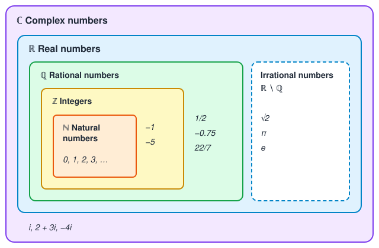

The letters can be followed by a superscript $+$ or $-$ to indicate that only positive or negative numbers are to be included in the set. For example:

$$\mathbb{R}^+ = \{x \mid x \text{ is a positive real number}\}$$
$$\mathbb{Z}^- = \{x \mid x \text{ is a negative integer}\}$$

The choice of universe of discourse can sometimes make a difference. For example, consider the statement $x^2 \lt 9$. If the universe of discourse of this statement were $\mathbb{R}$, then its truth set would be $\{x \in \mathbb{R} \mid x^2 \lt 9\}$, or in other words, the set of all real numbers between $-3$ and $3$, exclusive. But if the universe of discourse were $\mathbb{Z}$, then its truth set would be $\{x \in \mathbb{Z} \mid x^2 \lt 9\} = \{-2, -1, 0, 1, 2\}$.

Sometimes this explicit notation is used not to specify the universe of discourse but to restrict attention to just a part of the universe.

The **complement** of a set $S$ is the collection of objects in the universe of discourse $U$ that are not in $S$. The complement is written $S^c$. In curly brace notation:

$$S^c = \{x \mid (x \in U) \land (x \notin S)\}$$

or more compactly as:

$$S^c = \{x \mid x \notin S\}$$

However, it should be apparent that the complement of a set always depends on which universe of discourse is chosen. For example, if the universe of discourse is $\mathbb{Z}$, the complement of $\{-2, -1, 0, 1, 2\}$ is $\{x \in \mathbb{Z} \mid x^2 \geq 9\}$, but if the universe of discourse is $\mathbb{R}$, the complement is a completely different set that also contains numbers such as $2.5$ and $\pi$.

Because a set is completely determined once its elements have been specified, there is only one set that has no elements. It is called the **empty set**, or the **null set**, and is often denoted by $\emptyset$ or $\{\}$. For example, $\{x \in \mathbb{Z} \mid x \neq x\} = \emptyset$. Since the empty set has no elements, the statement $x \in \emptyset$ is always false.

### Exercises

**1\.** Analyze the logical forms of the following statements:

**a)** $3$ is a common divisor of $6$, $9$, and $15$.

We can let $D(x,y)$ stand for "$x$ is divisible by $y$". Therefore, the logical form of the statement is:

$$ D(6,3) \land D(9,3) \land D(15,3)$$

**b)** $x$ is divisible by both $2$ and $3$ but not $4$.

$$ D(x,2) \land D(x,3) \land \neg D(x,4) $$

**c)** $x$ and $y$ are natural numbers, and exactly one of them is prime.

We can let $P(w)$ stand for "$w$ is prime". Therefore, the logical form of the statement is:

$$ x \in \mathbb{N} \land y \in \mathbb{N} \land \bigl(P(x) \oplus P(y)\bigr) $$

**4\.** Write definitions using elementhood tests for the following sets:

**a)** $\{1, 4, 9, 16, 25, 36, 49, \dots\}$.

$$\{x \mid x \text{ is the square of a positive integer}\}$$

**b)** $\{1, 2, 4, 8, 16, 32, 64, \dots\}$.

$$\{x \mid x \text{ is a power of two}\}$$

**c)** $\{10, 11, 12, 13, 14, 15, 16, 17, 18, 19\}$.

$$ \{x \in \mathbb{N} \mid x \geq 10 \land x \leq 19 \} $$

**5\.** Simplify the following statements. Which variables are free and which are bound? If the statement has no free variables, say whether it is true or false.

**a)** $-3 \in \{x \in \mathbb{R} \mid 13 - 2x > 1\}$.

$x$ is the only bound variable, and there are no free variables. The statement is equivalent to $13 - 2 \cdot (-3) > 1$, that is, $19 > 1$, which is true.

**b)** $4 \in \{x \in \mathbb{R}^- \mid 13 - 2x > 1\}$.

$x$ is the only bound variable, and there are no free variables. The statement is false as $4$ is not in the **universe of discourse** $\mathbb{R}^-$.

**c)** $5 \notin \{x \in \mathbb{R} \mid 13 - 2x > c\}$.

$x$ is the only bound variable, and $c$ the only free variable. The statement is equivalent to $\neg(13 - 2 \cdot 5 > c)$, that is, $\neg(3 > c)$, so the statement is true for any $c \geq 3$.

**7\.** List the elements of the following sets:

**a)** $\{x \in \mathbb{R} \mid 2x^2 + x - 1 = 0\}$.

If we find the two roots of $2x^2 + x - 1 = 0$ we get $r_1=\frac{1}{2}$ and $r_2=-1$ so the only two elements that fulfil the elementhood test are $\frac{1}{2}$ and $-1$, and the set can be rewritten as $\{\frac{1}{2},-1\}$.

**b)** $\{x \in \mathbb{R}^+ \mid 2x^2 + x - 1 = 0\}$.

Now the **universe of discourse** is $\mathbb{R}^+$, so only positive real numbers can pass the elementhood test. Of the two roots, only $\frac{1}{2}$ is positive, therefore the set can be rewritten as $\{\frac{1}{2}\}$.

**c)** $\{x \in \mathbb{Z} \mid 2x^2 + x - 1 = 0\}$.

Now the **universe of discourse** is $\mathbb{Z}$, so only integers can pass the elementhood test. Of the two roots, only $-1$ is an integer, therefore the set can be rewritten as $\{-1\}$.

**d)** $\{x \in \mathbb{N} \mid 2x^2 + x - 1 = 0\}$.

Now the **universe of discourse** is $\mathbb{N}$, so only natural numbers can pass the elementhood test. Neither of the two roots is a natural number, therefore the set is equal to the empty set $\emptyset$.

**9\.** What are the truth sets of the following statements? List a few elements of the truth set if you can.

**a)** $x$ is a real number and $x^2 - 4x + 3 = 0$.

The polynomial factors as $(x - 1)(x - 3)$, so it has two real roots, therefore the truth set is:

$$\{1, 3\}$$

**b)** $x$ is a real number and $x^2 - 2x + 3 = 0$.

In this case the discriminant is $(-2)^2 - 4 \cdot 1 \cdot 3 = -8 < 0$, so no real number satisfies the equation. The quadratic formula gives only two complex roots $1 \pm i\sqrt{2}$, so the truth set is $\emptyset$.

**c)** $x$ is a real number and $5 \in \{y \in \mathbb{R} \mid x^2 + y^2 < 50\}$.

The statement is equivalent to $x^2 + 5^2 \lt 50$ which can be simplified to $x^2<25$ or $|x| < 5$ therefore the truth set is $\{x \mid -5 \lt x \lt 5\}$

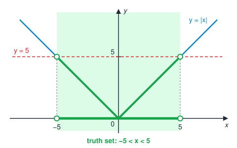

## 1.4 Operations on Sets

**Definition 1.4.1**. The **intersection** of two sets $A$ and $B$ is the set $A \cap B$ defined as follows:

$$A \cap B = \{x \mid x\in A \land x \in B\}$$

The **union** of $A$ and $B$ is the set $A \cup B$ defined as follows:

$$ A \cup B = \{x \mid x \in A \lor x \in B\}$$

The **difference** of $A$ and $B$ is the set $A \setminus B$ defined as follows:

$$ A \setminus B = \{x \mid x \in A \land x \notin B\}$$

Because $x \notin B$ means the same thing as $x \in B^c$, the difference of $A$ and $B$ is the intersection of $A$ with the complement of $B$:

$$ A \setminus B = \{x \mid x \in A \land x \in B^c\} = A \cap B^c$$

The **symmetric difference** of $A$ and $B$ is the set $A \triangle B$ defined as follows:

$$ A \triangle B = (A \setminus B) \cup (B \setminus A) = (A \cup B) \setminus (A \cap B) = \{x \mid x \in A \oplus x \in B\}$$

Sometimes it is helpful when working with operations on sets to draw pictures of the results of these operations. One way to do this is with **Venn diagrams**. The interior of the rectangle enclosing the diagram represents the universe of discourse $U$, and the interiors of the two circles represent the two sets $A$ and $B$. Other sets formed by combining these sets would be represented by different regions in the diagram.

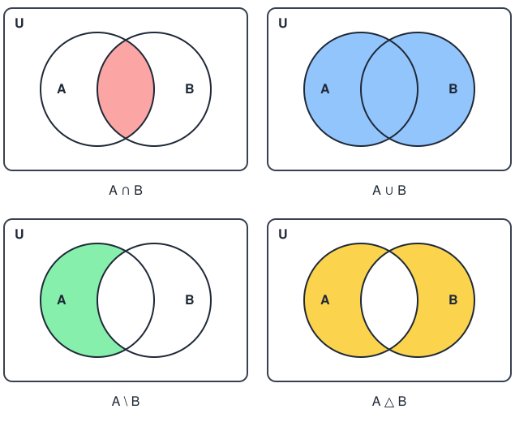

The set theory operations $\cap$, $\cup$, $\setminus$, and $\triangle$ are related to the logical connectives $\land$, $\lor$, $\neg$, and $\oplus$. It is important to remember, though, that although the set theory operations and logical connectives are related, they are not interchangeable. The logical connectives can only be used to combine statements, whereas the set theory operations must be used to combine sets. For example, if $A$ is the truth set of $P(x)$ and $B$ is the truth set of $Q(x)$, then we can say that $A \cap B$ is the truth set of $P(x) \land Q(x)$, but expressions such as $A \land B$ or $P(x) \cap Q(x)$ are completely meaningless and should never be used.

**Definition 1.4.5**. Suppose $A$ and $B$ are sets. We will say that $A$ is a **subset** of $B$ if every element of $A$ is also an element of $B$. We write $A \subseteq B$ to mean that $A$ is a subset of $B$. $A$ and $B$ are said to be **disjoint** if they have no elements in common. Note that this is the same as saying that the set of elements they have in common is the empty set, or in other words $A \cap B = \emptyset$.

**Example 1.4.6**. Consider the sets $A$, $B$ and $C$. Suppose that $A \subseteq B$, that $A$ and $C$ are disjoint ($A \cap C = \emptyset$), and that $B$ and $C$ are not disjoint ($B \cap C \neq \emptyset$). The Venn diagram will look as follows:

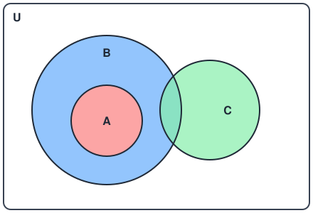

**Principle of double inclusion.** Two sets are equal if and only if each is a subset of the other. In symbolic notation:

$$(A = B) \iff (A \subseteq B) \land (B \subseteq A)$$

**Proof.** First assume that $A = B$. Every element of $A$ is an element of $A$, so every set is a subset of itself and $A \subseteq A$. Since $A = B$, we may substitute $B$ for $A$ on the left side of this expression and obtain $B \subseteq A$. Similarly, we may substitute on the right side and obtain $A \subseteq B$. We have thus demonstrated that if $A = B$, then $A$ and $B$ are both subsets of each other, giving us the first half of the proof.

Assume now that $A \subseteq B$ and $B \subseteq A$. Then the definition of subset tells us that any element of $A$ is an element of $B$. Similarly, any element of $B$ is an element of $A$. This means that $A$ and $B$ have the same elements, which satisfies the definition of set equality. We deduce $A = B$, and we have the second half of the proof.

This principle is the usual way to prove that two sets are equal: prove the two inclusions separately.

**Theorem 1.4.7**. For any sets $A$ and $B$, $(A \cup B) \setminus B \subseteq A$.

**Proof.** We must show that if something is an element of $(A \cup B) \setminus B$, then it must also be an element of $A$, so suppose that $x \in (A \cup B) \setminus B$. This means that $x \in A \cup B$ and $x \notin B$, or in other words, $(x \in A \lor x \in B) \land x \notin B$. Notice that these statements have the logical form $P \lor Q$ and $\neg Q$, where $P$ is $x \in A$ and $Q$ is $x \in B$. From these premises we can conclude that $P$ is true. Therefore, $x \in A$. Thus, anything that is an element of $(A \cup B) \setminus B$ must also be an element of $A$.

### Exercises

**1\.** Let $A = \{1, 3, 12, 35\}$, $B = \{3, 7, 12, 20\}$, and $C = \{x \mid x \text{ is a prime number}\}$. List the elements of the following sets. Are any of the sets below disjoint from any of the others? Are any of the sets below subsets of any others?

**a)** $A \cap B$.

$$ A \cap B = \{3,12\} $$

**b)** $(A \cup B) \setminus C$.

$$ (A \cup B) \setminus C = \{1, 12, 20, 35\} $$

**c)** $A \cup (B \setminus C)$.

$$ A \cup (B \setminus C) = \{1,3,12,20,35\} $$

**4\.** Use Venn diagrams to verify the following identities:

**a)** $A \setminus (A \cap B) = A \setminus B$.

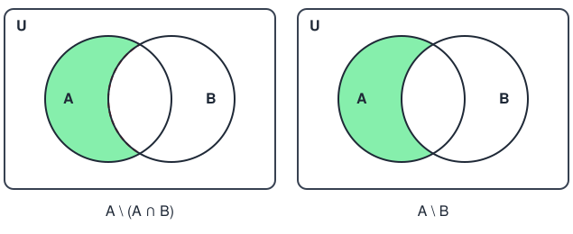

The two shaded regions are the same, so $A \setminus (A \cap B) = A \setminus B$.

**b)** $A \cup (B \cap C) = (A \cup B) \cap (A \cup C)$.

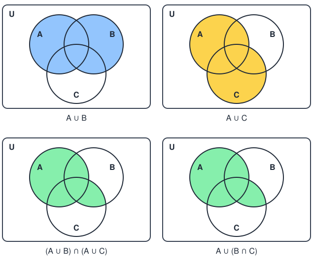

The region in both $A \cup B$ and $A \cup C$ is the same as the region of $A \cup (B \cap C)$, so $A \cup (B \cap C) = (A \cup B) \cap (A \cup C)$.

**5\.** Verify the identities in exercise 4 by writing out (using logical symbols) what it means for an object $x$ to be an element of each set and then using logical equivalences.

**a)** $A \setminus (A \cap B) = A \setminus B$.

We can write $A \setminus (A \cap B)$ in logical form: 

$$ x \in A \land \neg (x \in A \land x \in B)$$

If we apply the De Morgan's Law:

$$ x \in A \land (x \notin A \lor x \notin B)$$

If we apply the distributive property of the logic conjunction over the logic disjunction:

$$ (x \in A \land x \notin A) \lor ( x \in A \land x \notin B)$$

But $(x \in A \land x \notin A)$ is a contradiction, therefore the expression can be simplified to $( x \in A \land x \notin B)$ which is directly the logic form of $A \setminus B$.

**b)** $A \cup (B \cap C) = (A \cup B) \cap (A \cup C)$.

We can write $A \cup (B \cap C)$ in logical form:

$$ x \in A \lor (x \in B \land x \in C) $$

If we apply the distributive property of the logic disjunction over the logic conjunction:

$$ (x \in A \lor x \in B) \land (x \in A \lor x \in C) $$

This is directly the logical form of $(A \cup B) \cap (A \cup C)$.

**6\.** Use Venn diagrams to verify the following identities:

**a)** $(A \cup B) \setminus C = (A \setminus C) \cup (B \setminus C)$.

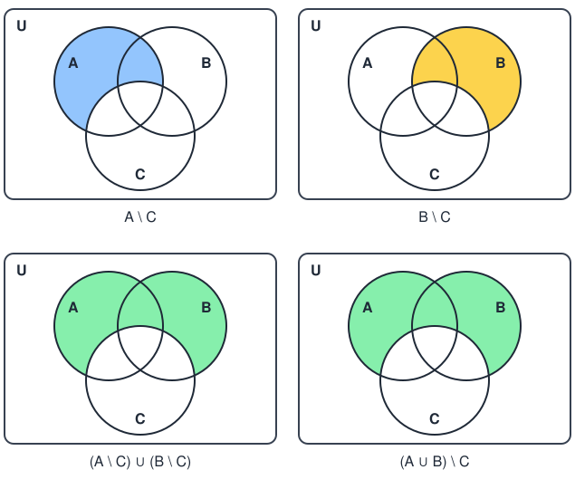

The union of $A \setminus C$ and $B \setminus C$ is the same region as $(A \cup B) \setminus C$, so $(A \cup B) \setminus C = (A \setminus C) \cup (B \setminus C)$.

**b)** $A \cup (B \setminus C) = (A \cup B) \setminus (C \setminus A)$.

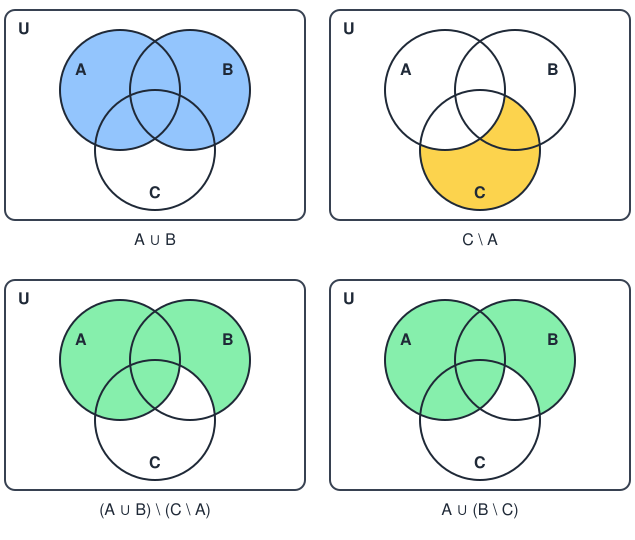

If we remove $C \setminus A$ from $A \cup B$, all of $A$ stays and only the part of $B$ outside $C$ stays. This is the same region as $A \cup (B \setminus C)$, so $A \cup (B \setminus C) = (A \cup B) \setminus (C \setminus A)$.

**7\.** Verify the identities in exercise 6 by writing out (using logical symbols) what it means for an object $x$ to be an element of each set and then using logical equivalences.

**a)** $(A \cup B) \setminus C = (A \setminus C) \cup (B \setminus C)$.

We can write $(A \cup B) \setminus C$ in logical form:

$$(x \in A \lor x \in B) \land x \notin C$$

If we apply the distributive property of the logic conjunction over the logic disjunction:

$$(x \in A \land x \notin C) \lor (x \in B \land x \notin C)$$

This is directly the logical form of $(A \setminus C) \cup (B \setminus C)$.

**b)** $A \cup (B \setminus C) = (A \cup B) \setminus (C \setminus A)$.

We can write $(A \cup B) \setminus (C \setminus A)$ in logical form:

$$ (x \in A \lor x \in B) \land \neg (x \in C \land x \notin A) $$

If we apply the De Morgan's Law:

$$ (x \in A \lor x \in B) \land (x \notin C \lor x \in A) $$

If we apply the distributive property of the logic disjunction over the logic conjunction:

$$ x \in A \lor (x \in B \land x \notin C) $$

This is directly the logical form of $A \cup (B \setminus C)$.

**8\.** Use any method you wish to verify the following identities:

**a)** $(A \setminus B) \cap C = (A \cap C) \setminus B$.

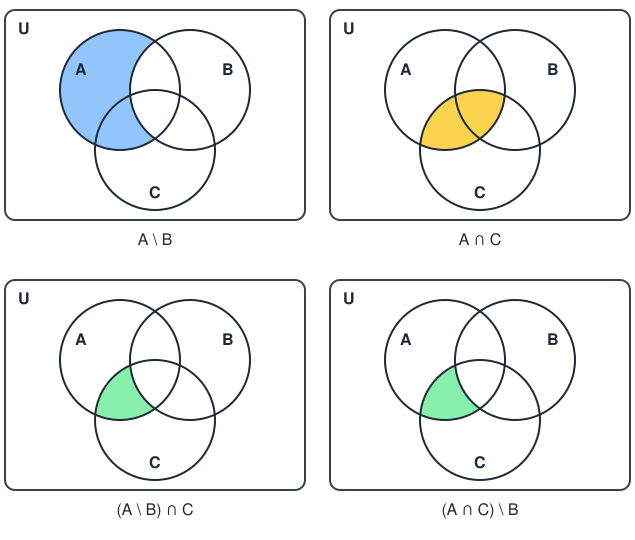

**b)** $(A \cap B) \setminus B = \emptyset$.

We can write the expression in logical form:

$$(x \in A \land x \in B) \land x \notin B$$

If we apply the associative property of the logical conjunction:

$$x \in A \land (x \in B \land x \notin B)$$

In this expression, $x \in B \land x \notin B$ is a contradiction, therefore the full expression always evaluates to false, so its truth set is the empty set $\emptyset$.

**c)** $A \setminus (A \setminus B) = A \cap B$.

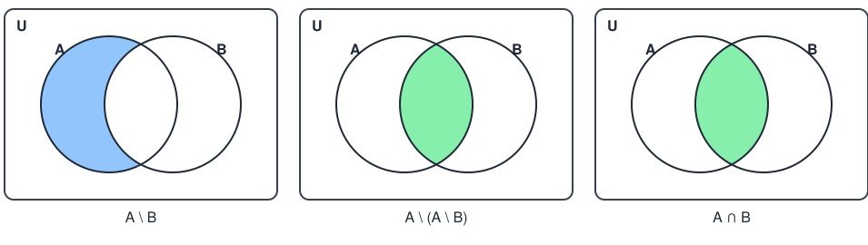

**11\.** Suppose $A$ and $B$ are sets. Is it necessarily true that $(A \setminus B) \cup B = A$? If not, is one of these sets necessarily a subset of the other? Is $(A \setminus B) \cup B$ always equal to either $A \setminus B$ or $A \cup B$?

We can write the expression $(A \setminus B) \cup B$ in logical form:

$$(x \in A \land x \notin B) \lor x \in B$$

If we apply the distributive property of the logical disjunction over the logical conjunction:

$$(x \in A \lor x \in B) \land (x \notin B \lor x \in B)$$

Here $x \notin B \lor x \in B$ is a tautology, therefore the expression can be simplified to $x \in A \lor x \in B$, which in set notation is $A \cup B$. So it is not necessarily true that $(A \setminus B) \cup B = A$. 

By definition, $A \subseteq (A \setminus B) \cup B$ if and only if every element of $A$ is also an element of $(A \setminus B) \cup B$. Since every $x \in A$ is also in $A \cup B$, and $A \cup B = (A \setminus B) \cup B$, we can say that $A \subseteq (A \setminus B) \cup B$.

We proved that $(A \setminus B) \cup B$ is always equal to $A \cup B$. However, it is equal to $A \setminus B$ only when $B$ is the empty set $\emptyset$, because no element of $B$ can be in $A \setminus B$.

**12\.** It is claimed in this section that you cannot make a Venn diagram for four sets using overlapping circles.

**a)** What's wrong with the following diagram? (Hint: Where's the set $(A \cap D) \setminus (B \cup C)$?)

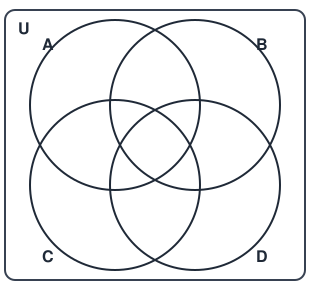

A Venn diagram is supposed to show every possible combination of the sets. For each set, an element of the universe of discourse is either in the set or not in it, so each set gives 2 possibilities. Four sets give $2^4 = 16$ combinations. This means that the diagram must be able to show an element in a region for any possible combination of the four sets. Each combination needs its own region.

This diagram has only 14, and $(A \cap D) \setminus (B \cup C)$ is one of the two that it does not have. So you cannot draw an element that is in $A$ and $D$ but not in $B$ or $C$, and the diagram is wrong.

**b)** Can you make a Venn diagram for four sets using shapes other than circles?

Yes. If we use ellipses instead of circles, every one of the 16 possible regions can appear:

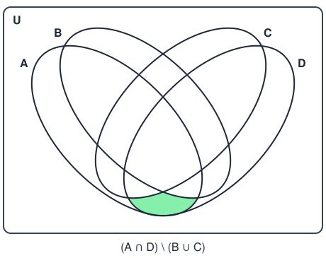

**14\.** Use Venn diagrams to show that the associative law holds for symmetric difference; that is, for any sets $A$, $B$, and $C$, $A \triangle (B \triangle C) = (A \triangle B) \triangle C$.

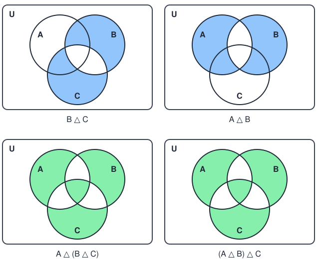

**17\.** Fill in the blanks to make true identities:

**a)** $(A \triangle B) \cap C = (C \setminus A) \triangle \underline{\qquad}$.

$$C \setminus B$$

**b)** $C \setminus (A \triangle B) = (A \cap C) \triangle \underline{\qquad}$.

$$ C \setminus B$$

**c)** $(B \setminus A) \triangle C = (A \triangle C) \triangle \underline{\qquad}$.

$$ A \cup B $$

## 1.5 The Conditional and Biconditional Connectives 

We introduce a new logical connective, $\rightarrow$, and write $P \rightarrow Q$ to represent the statement "If $P$ then $Q$". This statement is sometimes called a **conditional** statement, with $P$ as its **antecedent** and $Q$ as its **consequent**.

To analyze arguments containing the connective $\rightarrow$ we must work out the truth table for the formula $P \rightarrow Q$. Because $P \rightarrow Q$ is supposed to mean that if $P$ is true then $Q$ is also true, we certainly want to say that if $P$ is true and $Q$ is false then $P \rightarrow Q$ is false. If $P$ is true and $Q$ is also true, then it seems reasonable to say that $P \rightarrow Q$ is true.

| $P$ | $Q$ | $P \rightarrow Q$ |
| :-: | :-: | :-: |
| F | F | T |
| F | T | T |
| T | F | F |
| T | T | T |

To help us to understand this truth table, let's look at an example. Consider the statement "If $x > 2$ then $x^2 > 4$", which we could represent with the formula $P(x) \rightarrow Q(x)$, where $P(x)$ stands for the statement $x > 2$ and $Q(x)$ stands for $x^2 > 4$. The statements $P(x)$ and $Q(x)$ contain $x$ as a free variable, and each will be true for some values of $x$ and false for others. But surely, no matter what the value of $x$ is, we would say it is true that if $x > 2$ then $x^2 > 4$, so the conditional statement $P(x) \rightarrow Q(x)$ should be true.

Suppose $x=3$. In this case $x>2$ and $x^2 = 9 > 4$, so $P(x)$ and $Q(x)$ are both true. This corresponds to line four of the truth table. Consider now the case $x = 1$. Then $x < 2$ and $x^2 = 1 < 4$, so $P(x)$ and $Q(x)$ are both false, corresponding to line one of the truth table. 

Finally, consider the case $x = -5$. Then $x < 2$, so $P(x)$ is false, but $x^2 = 25 > 4$, so $Q(x)$ is true. Thus, in this case we find ourselves in the second line of the truth table.

There are many other values of $x$ that could be plugged into our statement "If $x > 2$ then $x^2 > 4$", but if you try them, you'll find that they all lead to line one, two, or four of the truth table. No values of $x$ will lead to line three, because you could never have $x > 2$ but $x^2 \leq 4$. There is no value of $x$ for which $P(x)$ is true but $Q(x)$ is false. Thus, it should make sense that in the truth table for $P(x) \rightarrow Q(x)$, the only line that is false is the line in which $P$ is true and $Q$ is false.

By comparing the truth tables, we can find the following statements that are equivalent to the conditional statement:

$$P \rightarrow Q \text{ is equivalent to } \neg P \lor Q$$

$$P \rightarrow Q \text{ is equivalent to } \neg(P \land \neg Q)$$

From the statements $P \rightarrow Q$ and $Q$, it is incorrect to infer $P$, because it is $P$ that determines $Q$ and not the contrary. But it would certainly be correct to infer $P$ from the statements $Q \rightarrow P$ and $Q$. This shows that the formulas $P \rightarrow Q$ and $Q \rightarrow P$ do not mean the same thing. The formula $Q \rightarrow P$ is called the *converse* of $P \rightarrow Q$, and it is very important to make sure that a conditional statement is not confused with its converse.

Another equivalence that relates the conditional argument with its converse is the **contrapositive** law:

$$P \rightarrow Q \text{ is equivalent to } \neg Q \rightarrow \neg P$$

Statements of the form $P \rightarrow Q$ come up very often in mathematics, but sometimes they are not written in the form "If $P$ then $Q$". Here are a few ways of expressing the idea $P \rightarrow Q$ that are used often in mathematics: 

  - $P$ implies $Q$
  - $Q$, if $P$
  - $P$ only if $Q$
  - $P$ is a sufficient condition for $Q$
  - $Q$ is a necessary condition for $P$
  
Often in mathematics we want to say that both $P \rightarrow Q$ and its converse $Q \rightarrow P$ are true, and it is therefore convenient to introduce a new connective symbol $\leftrightarrow$ to express this. You can think of $P \leftrightarrow Q$ as just an abbreviation for the formula $(P \rightarrow Q) \land (Q \rightarrow P)$. A statement of the form $P \leftrightarrow Q$ is called a **biconditional** statement, because it represents two conditional statements. This is often written as "$P$ if and only if $Q$". The phrase **if and only if** occurs so often in mathematics that there is a common abbreviation for it, **iff**. Thus, $P \leftrightarrow Q$ is often written "$P$ iff $Q$". Another statement that means $P \leftrightarrow Q$ is "$P$ is a necessary and sufficient condition for $Q$".

### Exercises

**1\.** Analyze the logical forms of the following statements:

**a)** If this gas either has an unpleasant smell or is not explosive, then it isn't hydrogen.

**b)** Having both a fever and a headache is a sufficient condition for George to go to the doctor.

**c)** Both having a fever and having a headache are sufficient conditions for George to go to the doctor.

**d)** If $x \neq 2$, then a necessary condition for $x$ to be prime is that $x$ be odd.

**3\.** Analyze the logical form of the following statement:

**a)** If it is raining, then it is windy and the sun is not shining.

Now analyze the following statements. Also, for each statement determine whether the statement is equivalent to either statement (a) or its converse.

**b)** It is windy and not sunny only if it is raining.

**c)** Rain is a sufficient condition for wind with no sunshine.

**d)** Rain is a necessary condition for wind with no sunshine.

**e)** It's not raining, if either the sun is shining or it's not windy.

**f)** Wind is a necessary condition for it to be rainy, and so is a lack of sunshine.

**g)** Either it is windy only if it is raining, or it is not sunny only if it is raining.

**8\.**

**a)** Show that $(P \rightarrow Q) \land (Q \rightarrow R)$ is equivalent to $(P \rightarrow R) \land [(P \leftrightarrow Q) \lor (R \leftrightarrow Q)]$.

**b)** Show that $(P \rightarrow Q) \lor (Q \rightarrow R)$ is a tautology.

**10\.** Find a formula involving only the connectives $\neg$ and $\rightarrow$ that is equivalent to $P \leftrightarrow Q$.

**11\.**

**a)** Show that $(P \lor Q) \leftrightarrow Q$ is equivalent to $P \rightarrow Q$.

**b)** Show that $(P \land Q) \leftrightarrow Q$ is equivalent to $Q \rightarrow P$.

**12\.** Which of the following formulas are equivalent?

**a)** $P \rightarrow (Q \rightarrow R)$.

**b)** $Q \rightarrow (P \rightarrow R)$.

**c)** $(P \rightarrow Q) \land (P \rightarrow R)$.

**d)** $(P \land Q) \rightarrow R$.

**e)** $P \rightarrow (Q \land R)$.
