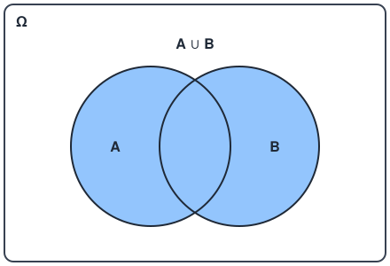
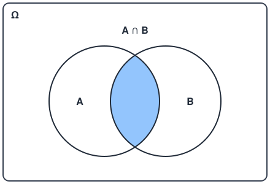
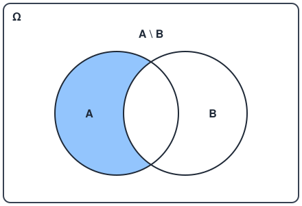
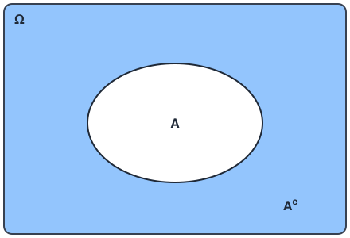
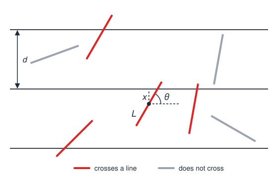
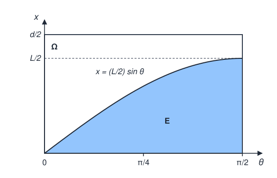

# 1 Introduction to Probability and Set Theory

## 1.1 Deterministic vs Aleatory Experiments and Philosophy

### Deterministic Experiment

A deterministic experiment gives the same result each time that we do it under the same conditions. If we know the conditions, we can calculate the result before we do the experiment. The transformation law is determined and known, so we say that a deterministic experiment is a **white box**.

### Aleatory Experiment

An aleatory (random) experiment can give different results each time that we do it under the same conditions. We may know the set of all possible results before we do the experiment, but we cannot know which result will occur in one trial. The transformation law is unknown to us, either because it does not exist or simply because we do not know it, so we say that an aleatory experiment is a **black box**.

Sometimes we can also assign a probability to each of the possible results, but this is not always possible:

- If we can assign a probability to each result, we have a situation of **risk**.
- If we cannot, we have a situation of complete **uncertainty**.

### History and Philosophy of Randomness

Randomness is not only a mathematical tool. It is also a philosophy, because it changes how we think about nature.

The modern scientific paradigm started with Nicolaus Copernicus (1473–1543), who published *De revolutionibus* in 1543, and with Galileo Galilei (1564–1642). Francis Bacon (1561–1626) then gave the scientific method its formal structure in *Novum Organum* (1620). At the start, science tried to explain large-scale phenomena, mainly the motion of the planets. With time, this approach became stronger, and Isaac Newton (1643–1727) published the *Principia* in 1687.

The objective was always the same: to find clear mathematical laws that describe each natural system like a Swiss clock. If we know the laws, we can predict exactly what will occur at each moment. Pierre-Simon Laplace (1749–1827) gave the classic statement of this idea in *A Philosophical Essay on Probabilities* (1814). An intellect that knows all the forces and all the positions in nature at one moment could describe the movements of all bodies in a single formula, and for it "the future just like the past would be present before its eyes". In the words of the previous section, nature was a white box.

This scientific success also moved into politics and society. The Enlightenment (approximately 1685–1815) applied the same clockwork model to society, where each part must operate with exact precision relative to the other parts. This model was often very rigid. Immanuel Kant (1724–1804) is a good example, because he agreed with the rule "let justice be done, though the world perish" (*fiat iustitia, et pereat mundus*) in *Perpetual Peace* (1795). The phrase itself is older than Kant. People usually attribute it to Emperor Ferdinand I in the 16th century, but Kant adopted it as a principle of politics.

In the 20th century, this paradigm started to break. When physics studied the atom, it found a serious problem. From 1925 to 1927, Niels Bohr (1885–1962), Werner Heisenberg (1901–1976) and other physicists gave a revolutionary interpretation of nature at the microscopic scale, which we now call the Copenhagen interpretation. In their interpretation, the problem is not that we do not know the transformation law. The problem is that nature is intrinsically random.

Some scientists did not accept this idea. Albert Einstein (1879–1955) said that "God does not play dice", and the famous debate between Bohr and Einstein started at the Solvay Conference in Brussels in 1927. In 1935, Einstein, Boris Podolsky (1896–1966) and Nathan Rosen (1909–1995) published a thought experiment (*Gedankenexperiment*), which we now call the EPR paradox. They said that the theory was incomplete, and that some **latent variables** (hidden variables), which the theory did not include, control the results. A latent variable is a variable that we cannot observe, but that has an effect on the results that we observe. Einstein and his colleagues still followed the old deterministic paradigm.

In 1964, John Stewart Bell (1928–1990) published Bell's inequalities, which make it possible to test the EPR position with experiments. The experiments of Alain Aspect in 1982, and of other physicists after him, showed that the EPR position was wrong: no *local* hidden-variable theory can reproduce the results. For these experiments, Aspect, John Clauser and Anton Zeilinger got the Nobel Prize in Physics in 2022.

Bell's inequalities do not eliminate non-local hidden-variable theories, such as the Bohmian mechanics of David Bohm (1952), so "nature is intrinsically random" remains an interpretation. But it is the interpretation that most physicists accept today: physical systems, at least at the microscopic scale, do not need more variables to explain them. They are intrinsically random.

This idea had a very large effect on science, because it was not a small change. It required a completely different method of work. Fields that had no relation to physics started to use random models. Economists asked a new question: maybe the apparent complexity of economic systems does not prevent mathematical models, and maybe we simply used the wrong models. Finance asked the same question.

### Applications of Probability and Statistics

Today, probability and stochastic processes have very many applications. Instead of models that try to remove the randomness, scientists now build models that include it. A stochastic process is a mathematical model of a quantity that changes with time in a random way.

#### Finance

In finance, we use probability to calculate the value of financial instruments. The future price of a stock is not predictable, so we model it as a stochastic process. Louis Bachelier (1870–1946) first did this in his thesis *Théorie de la spéculation* (1900), where he used Brownian motion to describe the prices on the Paris stock exchange. Fischer Black (1938–1995), Myron Scholes and Robert Merton later built the Black–Scholes model (1973). This model gives the price of an option from the random movement of the price of the underlying stock. Most modern pricing and risk models in banks follow this approach.

#### Economics

In economics, central banks use dynamic stochastic general equilibrium (DSGE) models to forecast inflation, interest rates and unemployment. The name describes the model:

- *Dynamic* means that the model follows the economy over time.
- *Stochastic* means that random shocks hit the economy in each period, for example a sudden change in the price of oil or a new technology. The model cannot know these shocks in advance.
- *General equilibrium* means that the model describes all the markets of the economy together, so that supply and demand match in all of them at the same time.

The forecast is therefore not a single number, but a distribution of possible futures.

#### Biology

In biology, the SIR model forecasts the number of infected people in an epidemic. The model divides the population into three groups: susceptible (S), infected (I) and recovered (R). People move from S to I when they get the infection, and from I to R when they recover or die, so R is also called "removed". In the stochastic version of the model, each infection and each recovery is a random event, so the model gives a probability for each possible size of the epidemic.

#### Physics

In physics, quantum mechanics and statistical mechanics both use probability. In quantum mechanics, the theory does not give the result of a measurement. It gives the probability of each possible result. Statistical mechanics explains quantities such as temperature and pressure from the random motion of very many particles. Today physicists also write many parts of physics again with probabilistic concepts, for example with entropy and information as basic quantities.

#### Machine Learning and Artificial Intelligence

Machine learning and artificial intelligence have probability theory as their base. A classifier does not say "this image is a cat". It gives a probability for each possible class. A language model gives a probability for each possible next word, and then selects one of them. When we train a model, we usually search for the parameters that give the highest probability to the data that we observed. This is the principle of maximum likelihood, which comes from statistics. Bayesian methods, which update a probability when new data arrives, are also common in this field.

#### Mathematics

Probability theory also needs other branches of mathematics. Measure theory is the base of probability theory itself. Andrey Kolmogorov (1903–1987) showed this in 1933 in *Grundbegriffe der Wahrscheinlichkeitsrechnung* (Foundations of the Theory of Probability), where he gave the axioms that we still use today:

- A probability is a measure on a collection of events.
- The measure of the whole sample space is equal to one.
- The measure is countably additive: if the events in a sequence cannot occur together, the probability that one of them occurs is the sum of their probabilities.

Functional analysis is also important for stochastic processes. A random variable is a measurable function. The random variables with a finite second moment form a Hilbert space, and many results about stochastic processes use this space and the theory of operator semigroups.

## 1.2 Introduction to Set Theory

### Sample Space

For an aleatory experiment to be useful, it must have two characteristics:

1. We must be able to repeat it as many times as we want, under identical conditions (a controlled environment).
2. It must have a well-defined set of **simple results** (elementary outcomes).

We define the **sample space $\Omega$** as the set of all possible simple results of a specific aleatory experiment. We call each element of $\Omega$ an **outcome** (or sample point), and we write it as $\omega_i$:

$$\Omega = \lbrace \omega_1, \omega_2, \ldots, \omega_N \rbrace$$

Each trial of the experiment gives exactly one outcome.

The sample space can be **discrete** or **continuous**:

- A **discrete** sample space is finite or countably infinite, so we can list its outcomes, for example the six faces of a die.
- A **continuous** sample space is uncountable, usually an interval of real numbers, for example the lifetime of a light bulb, $\Omega = [0, \infty)$.

### Events

An event $E_i \subseteq \Omega$ is a subset of the sample space. It is a set of outcomes that we are interested in. To find out if an event occurs, we do one trial and get one outcome $\omega$. If $\omega \in E_i$, the event $E_i$ occurs. If $\omega \notin E_i$, it does not occur.

**Example:** For a die with the numbers 1 to 6, the sample space has these outcomes:

$$\Omega = \lbrace \omega_1 = 1, \omega_2 = 2, \omega_3 = 3, \omega_4 = 4, \omega_5 = 5, \omega_6 = 6 \rbrace$$

We can define these events:

- $E_1$: the outcome is 2.
- $E_2$: the outcome is an even number.
- $E_3$: the outcome is an odd number.

As sets, these events are:

$$E_1 = \lbrace 2 \rbrace \qquad E_2 = \lbrace 2, 4, 6 \rbrace \qquad E_3 = \lbrace 1, 3, 5 \rbrace$$

If we roll a 4, then $4 \in E_2$, so $E_2$ occurs. But $4 \notin E_1$ and $4 \notin E_3$, so $E_1$ and $E_3$ do not occur.

#### Special Events

Some events have special names:

- **Elementary event:** an event with only one outcome, for example $\lbrace 3 \rbrace$. In the example above, $E_1 = \lbrace 2 \rbrace$ is an elementary event.
- **Certain event:** the sample space $\Omega$ itself. It always occurs.
- **Impossible event:** the empty set $\emptyset$. It never occurs.

### Set Operators

#### Membership Operator

We say that a set $A$ **is contained in** a set $B$ ($A \subseteq B$) when each element of $A$ is also an element of $B$. The opposite is not necessarily true: $B$ can have elements that are not in $A$. We also say that $A$ is a **subset** of $B$.

$$A \subseteq B \iff (x \in A \Rightarrow x \in B), \quad \forall x \in A$$

> [!NOTE]
> **Membership and inclusion**
>
> Strictly, this relation is called **inclusion**. The symbol $\in$ is the membership operator: it relates an element to a set ($x \in A$). The symbol $\subseteq$ relates a set to a set ($A \subseteq B$). Some texts write $\subset$ for the same relation.

In the example of the die, $E_1 = \lbrace 2 \rbrace$ and $E_2 = \lbrace 2, 4, 6 \rbrace$, so $E_1 \subseteq E_2$. In terms of events, if $E_1$ occurs, then $E_2$ also occurs.

The inclusion relation has these properties:

1. If $A \subseteq B$ and $B \subseteq A$, then $A = B$.
2. If $A$ is an event and $\Omega$ is the sample space, then $A \subseteq \Omega$ always.
3. If $\emptyset$ is the empty set (the impossible event), then $\emptyset \subseteq A$ for each event $A$.
4. The inclusion is transitive:

$$A \subseteq B, \quad B \subseteq C \implies A \subseteq C$$

#### Union Operator

The **union** of two sets $A$ and $B$ ($A \cup B$) is the set of all the elements of $A$ and all the elements of $B$. It is an inclusive "or": an element that is in both $A$ and $B$ is also in $A \cup B$.

$$A \cup B = \lbrace x : x \in A \lor x \in B \rbrace$$

In terms of events, $A \cup B$ occurs when $A$ occurs, $B$ occurs, or both occur. In the example of the die, $E_1 \cup E_3 = \lbrace 1, 2, 3, 5 \rbrace$ and $E_2 \cup E_3 = \Omega$.

The union operator has these properties:

1. **Commutativity:** $A \cup B = B \cup A$.
2. If $A \subseteq B$, then $A \cup B = B$.
3. $A \cup \emptyset = A$.
4. **Idempotence:** $A \cup A = A$.
5. **Associativity:** $A \cup B \cup C = (A \cup B) \cup C = A \cup (B \cup C)$.

#### Intersection Operation

The **intersection** of two sets $A$ and $B$ ($A \cap B$) is the set of the elements that are in $A$ and in $B$ at the same time. It is an "and": an element that is only in $A$, or only in $B$, is not in $A \cap B$.

$$A \cap B = \lbrace x : x \in A \land x \in B \rbrace$$

In terms of events, $A \cap B$ occurs when $A$ and $B$ both occur. In the example of the die, $E_1 \cap E_2 = \lbrace 2 \rbrace$ and $E_2 \cap E_3 = \emptyset$, because an outcome cannot be even and odd at the same time.

The intersection operator has these properties:

1. **Commutativity:** $A \cap B = B \cap A$.
2. If $A \subseteq B$, then $A \cap B = A$.
3. $A \cap \emptyset = \emptyset$.
4. **Idempotence:** $A \cap A = A$.
5. **Associativity:** $A \cap B \cap C = (A \cap B) \cap C = A \cap (B \cap C)$.

#### Distributive Property of Union and Intersection

The union distributes over the intersection, and the intersection distributes over the union:

$$A \cup (B \cap C) = (A \cup B) \cap (A \cup C)$$

$$A \cap (B \cup C) = (A \cap B) \cup (A \cap C)$$

#### Incompatible Events

If the intersection of two events is the empty set, $A \cap B = \emptyset$, we say that the events are **incompatible** (or mutually exclusive). Two incompatible events cannot occur together in one trial. In the example of the die, $E_2 \cap E_3 = \emptyset$, so "even" and "odd" are incompatible events.

#### Difference of Sets

The **difference** of two sets $A$ and $B$ ($A \setminus B$) is the set of the elements that are in $A$ but not in $B$:

$$A \setminus B = \lbrace x : x \in A \land x \notin B \rbrace$$

In terms of events, $A \setminus B$ occurs when $A$ occurs and $B$ does not occur. In the example of the die:

$$E_2 \setminus E_1 = \lbrace 2, 4, 6 \rbrace \setminus \lbrace 2 \rbrace = \lbrace 4, 6 \rbrace$$

The difference is not commutative. For example, $E_1 \setminus E_2 = \lbrace 2 \rbrace \setminus \lbrace 2, 4, 6 \rbrace = \emptyset$, which is not equal to $E_2 \setminus E_1$.

The difference has these properties:

1. $A \setminus \emptyset = A$.
2. $A \setminus A = \emptyset$.
3. $A \subseteq B \iff A \setminus B = \emptyset$.
4. $A \cap B = \emptyset \iff A \setminus B = A$.
5. $A \setminus B = A \cap B^c$, where $B^c$ is the complement of $B$ (see [Complementary Set](#complementary-set)).

#### Universe of Discourse

The **universe of discourse** $U$ is the set that contains all the elements that we talk about. Each set that we use in a discussion is a subset of $U$. For events, the universe of discourse is usually the sample space, $U = \Omega$.

#### Complementary Set

The **complement** of a set $A$, written $A^c$, is the set of the elements of $U$ that are not in $A$:

$$A^c = \lbrace x \in U : x \notin A \rbrace$$

Thus the complement is the difference of $U$ and $A$ (see [Difference of Sets](#difference-of-sets)):

$$A^c = U \setminus A$$

The complement always needs a universe of discourse, because "the elements that are not in $A$" has no clear meaning without it. For example, if $A = \lbrace 2, 4, 6 \rbrace$, the elements that are not in $A$ can be $\lbrace 1, 3, 5 \rbrace$, all the other natural numbers, or all the other real numbers. The answer depends on $U$.

For events, $U = \Omega$, so the complement $A^c$ is the set of the outcomes in $\Omega$ that are not in $A$:

$$A^c = \Omega \setminus A = \lbrace x \in \Omega : x \notin A \rbrace$$

In terms of events, $A^c$ occurs when $A$ does not occur. In each trial, exactly one of $A$ and $A^c$ occurs. In the example of the die, $E_2^c = \lbrace 1, 3, 5 \rbrace = E_3$, so "not even" is the same event as "odd".

The complement has these properties:

1. **Involution:** $(A^c)^c = A$.
2. $A \cup A^c = U$.
3. $A \cap A^c = \emptyset$.
4. $\emptyset^c = U$.
5. $U^c = \emptyset$.

Properties 2 and 3 say that $A$ and $A^c$ are incompatible events, and that together they cover all of $\Omega$.

#### De Morgan's Laws

De Morgan's laws give the complement of a union and the complement of an intersection (see [Complementary Set](#complementary-set)):

1. **De Morgan's first law:** $(A \cup B)^c = A^c \cap B^c$.
2. **De Morgan's second law:** $(A \cap B)^c = A^c \cup B^c$.

De Morgan's laws tell us that the complement changes a union into an intersection, and an intersection into a union. In terms of events, "not ($A$ or $B$)" is the same as "not $A$ and not $B$". Also, "not ($A$ and $B$)" is the same as "not $A$ or not $B$".

**Example of the first law:** For the die, $E_1 \cup E_2 = \lbrace 2, 4, 6 \rbrace$, so $(E_1 \cup E_2)^c = \lbrace 1, 3, 5 \rbrace$. On the other side, $E_1^c \cap E_2^c = \lbrace 1, 3, 4, 5, 6 \rbrace \cap \lbrace 1, 3, 5 \rbrace = \lbrace 1, 3, 5 \rbrace$. The two sides give the same set.

**Example of the second law:** For the die, $E_1 \cap E_2 = \lbrace 2 \rbrace$, so $(E_1 \cap E_2)^c = \lbrace 1, 3, 4, 5, 6 \rbrace$. On the other side, $E_1^c \cup E_2^c = \lbrace 1, 3, 4, 5, 6 \rbrace \cup \lbrace 1, 3, 5 \rbrace = \lbrace 1, 3, 4, 5, 6 \rbrace$. The two sides give the same set.

**Generalization of the first law:** The first law is also true for any finite number of sets. For each $I \in \mathbb{N}$ and for each family of sets $A_0, A_1, \dots, A_I$:

$$\left( \bigcup_{i=0}^{I} A_i \right)^c = \bigcap_{i=0}^{I} A_i^c$$

**Proof:** Two sets $X$ and $Y$ are equal if and only if $X \subseteq Y$ and $Y \subseteq X$ (the principle of double inclusion). Thus we prove the two inclusions $\left( \bigcup_{i=0}^{I} A_i \right)^c \subseteq \bigcap_{i=0}^{I} A_i^c$ and $\bigcap_{i=0}^{I} A_i^c \subseteq \left( \bigcup_{i=0}^{I} A_i \right)^c$.

To prove the first inclusion, let $x$ be an arbitrary element of $\left( \bigcup_{i=0}^{I} A_i \right)^c$. By the definition of the complement, $x \notin \bigcup_{i=0}^{I} A_i$. By the definition of the union, there is no value of $i \in \lbrace 0, 1, \dots, I \rbrace$ such that $x \in A_i$. Thus, for each $i$, $x \notin A_i$, that is, $x \in A_i^c$. By the definition of the intersection, $x \in \bigcap_{i=0}^{I} A_i^c$. Because $x$ is arbitrary, each element of the first set is also in the second set:

$$\left( \bigcup_{i=0}^{I} A_i \right)^c \subseteq \bigcap_{i=0}^{I} A_i^c$$

To prove the second inclusion, now let $x$ be an arbitrary element of $\bigcap_{i=0}^{I} A_i^c$. By the definition of the intersection, $x \in A_i^c$ for each $i \in \lbrace 0, 1, \dots, I \rbrace$. By the definition of the complement, $x \notin A_i$ for each $i$. Thus there is no value of $i$ such that $x \in A_i$, and by the definition of the union, $x \notin \bigcup_{i=0}^{I} A_i$. By the definition of the complement, $x \in \left( \bigcup_{i=0}^{I} A_i \right)^c$. Because $x$ is arbitrary, each element of the second set is also in the first set:

$$\bigcap_{i=0}^{I} A_i^c \subseteq \left( \bigcup_{i=0}^{I} A_i \right)^c$$

The two inclusions are true, so by the principle of double inclusion:

$$\left( \bigcup_{i=0}^{I} A_i \right)^c = \bigcap_{i=0}^{I} A_i^c$$

$\blacksquare$

### Buffon's Needle Problem

Georges-Louis Leclerc, Comte de Buffon (1707–1788), posed this problem in 1733. It is one of the first problems of geometric probability.

**Problem statement:** A floor has parallel lines drawn on it. The distance between two neighboring lines is $d$. We drop a needle of length $L$ at random on the floor, with $L \le d$. What is the probability that the needle crosses one of the lines?

#### Parameters of the Problem

Before we calculate, we must identify the quantities in the problem. There are two types of quantities: fixed parameters and random variables.

The **fixed parameters** do not change from one trial to the next:

- $d$: the distance between two neighboring lines.
- $L$: the length of the needle, with $L \le d$.

The condition $L \le d$ is important. A needle that is not longer than the distance between the lines can cross a maximum of one line. Thus the needle crosses one line, or it crosses no line.

#### Random Variables

To know if a needle crosses a line, we must know where it falls and how it points. The figure shows that two numbers give all this information:

- $x$: the distance from the center of the needle to the nearest line.
- $\theta$: the angle between the needle and the lines.

The horizontal position of the needle along the lines is not important, because all the positions along a line are equal. Thus $x$ and $\theta$ are sufficient.

Each of the two variables has a range:

- The center of the needle is always between two lines, and the nearest line is at a maximum distance of $d/2$. Thus $0 \le x \le d/2$.
- The angles $\theta$ and $\pi - \theta$ give two needles that are mirror images of each other. They have the same distance to the line, so we can use only $0 \le \theta \le \pi/2$.

"At random" means two things:

1. $x$ has a uniform distribution on $[0, d/2]$, so the needle has no preferred position.
2. $\theta$ has a uniform distribution on $[0, \pi/2]$, so the needle has no preferred direction. Also, $\theta$ is independent of $x$.

#### Sample Space

Each trial gives one pair $(x, \theta)$. Thus the sample space is a rectangle in the plane:

$$\Omega = \lbrace (x, \theta) : 0 \le x \le d/2, \quad 0 \le \theta \le \pi/2 \rbrace$$

The two conditions are independent of each other, so we can also write $\Omega$ as the Cartesian product of the range of $x$ and the range of $\theta$:

$$\Omega = [0, d/2] \times [0, \pi/2]$$

The Cartesian product $A \times B$ is the set of all the ordered pairs $(a, b)$ with $a \in A$ and $b \in B$.

This is a continuous sample space, because it has an uncountable number of outcomes. We cannot count the outcomes, so we measure the area of the rectangle:

$$\text{Area}(\Omega) = \frac{d}{2} \cdot \frac{\pi}{2} = \frac{\pi d}{4}$$

#### Condition for a Crossing

Now we must find the outcomes in which the needle crosses a line. Each half of the needle has the length $L/2$. The vertical distance that one half covers, from the center toward the nearest line, is $\frac{L}{2} \sin \theta$.

The needle crosses the line when this vertical distance is equal to or larger than the distance from the center to the line:

$$x \le \frac{L}{2} \sin \theta$$

Thus the event "the needle crosses a line" is this subset of $\Omega$:

$$E = \lbrace (x, \theta) \in \Omega : x \le \tfrac{L}{2} \sin \theta \rbrace$$

Because $L \le d$, we have $\frac{L}{2} \sin \theta \le \frac{d}{2}$, so the region $E$ is always inside the rectangle $\Omega$.

#### Strategy of the Solution

The distribution of the outcomes on $\Omega$ is uniform. Thus each region of $\Omega$ has a probability that is proportional to its area. The probability of a crossing is the part of the rectangle that $E$ covers:

$$P(E) = \frac{\text{Area}(E)}{\text{Area}(\Omega)}$$

We know $\text{Area}(\Omega)$. The next step is to calculate $\text{Area}(E)$, which is the area under the curve $x = \frac{L}{2} \sin \theta$ for $\theta$ from $0$ to $\pi/2$.

The figure shows $\Omega$ and $E$ in the plane $(\theta, x)$. The function $x = \frac{L}{2} \sin \theta$ starts at $0$ when $\theta = 0$. At that angle the needle is parallel to the lines, so it can touch a line only if $x = 0$. The function increases to its maximum $L/2$ when $\theta = \pi/2$. At that angle the needle is perpendicular to the lines, so it crosses a line if $x \le \frac{L}{2}$. Also, if the center of the needle is at a distance $x = 0$ from the line, the needle touches the line for all values of $\theta$.

The shaded area under the curve is the event $E$ where the needle crosses the line. The white area above the curve is $E^c$, where the needle does not cross a line.

To calculate the area of $E$, we integrate the curve $x = \frac{L}{2} \sin \theta$ from $\theta = 0$ to $\theta = \pi/2$:

$$\text{Area}(E) = \int_{0}^{\pi/2} \frac{L}{2} \sin \theta \ d\theta$$

We can solve this integral with Barrow's rule.

> [!NOTE]
> **Barrow's rule**
>
> If $f$ is continuous on $[a, b]$ and $f = g'$ for some function $g$, then:
>
> $$\int_{a}^{b} f(t) \ dt = g(b) - g(a)$$
>
> Barrow's rule is a consequence of the fundamental theorem of calculus.

To use the rule, we need a function $g$ with $g'(\theta) = \frac{L}{2} \sin \theta$. The derivative of the cosine is:

$$\frac{d}{d\theta} \cos \theta = -\sin \theta$$

Thus $g(\theta) = -\frac{L}{2} \cos \theta$ has the derivative $g'(\theta) = \frac{L}{2} \sin \theta$. The function $\sin \theta$ is continuous on $[0, \pi/2]$, so Barrow's rule applies:

$$\text{Area}(E) = \int_{0}^{\pi/2} \frac{L}{2} \sin \theta \ d\theta = g\left(\frac{\pi}{2}\right) - g(0) = -\frac{L}{2} \cos \frac{\pi}{2} + \frac{L}{2} \cos 0 = -\frac{L}{2} \cdot 0 + \frac{L}{2} \cdot 1 = \frac{L}{2}$$

#### Probability of a Crossing

We now know the two areas. The probability of a crossing is the ratio of the area of $E$ to the area of $\Omega$:

$$P(E) = \frac{\text{Area}(E)}{\text{Area}(\Omega)} = \frac{L/2}{\pi d/4} = \frac{L}{2} \cdot \frac{4}{\pi d} = \frac{2L}{\pi d}$$

Thus the final solution is:

$$P(\text{the needle crosses a line}) = \frac{2L}{\pi d}$$

For example, if the length of the needle is equal to the distance between the lines ($L = d$), then $P(E) = \frac{2}{\pi} \approx 0.6366$.

### Deterministic Results from Probability

In the previous section, we found that the probability of a crossing in Buffon's needle problem is $\frac{2L}{\pi d}$. This result contains $\pi$, a constant that has nothing random in it. We can use this relation in the opposite direction. If we drop the needle $n$ times and it crosses a line $k$ times, the fraction $k/n$ is an approximation of $P(E)$. When $n$ increases, the approximation becomes better. Thus:

$$\frac{k}{n} \approx \frac{2L}{\pi d} \quad \Rightarrow \quad \pi \approx \frac{2Ln}{dk}$$

A random experiment gives an approximation of a deterministic number.

The same idea is the base of **Monte Carlo simulation**. In Buffon's needle problem, we calculated an integral to get a probability. Monte Carlo simulation does the opposite: it uses a probability to get an integral. We did not do a Monte Carlo simulation here, but the idea is the same.

Probability is a different way to approach a problem. Some problems also have a deterministic solution, but in many cases that solution is much more difficult to find. For example, an integral can have no antiderivative that we can write, or it can have many variables. In these cases, an exact calculation can be very difficult or not possible. A probabilistic method only needs many random trials and a count of the results, and it gives an approximation that becomes better with more trials.

