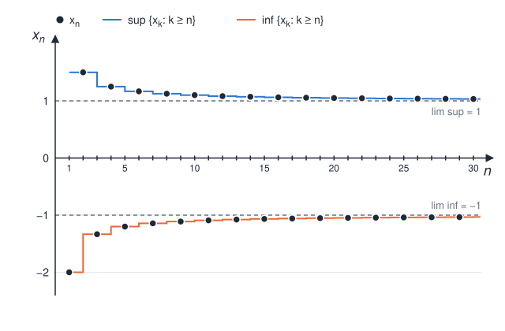

# 2 Sequences of Sets

## 2.1 Definition of Sequence

Sequences are fundamental in mathematics, and are the basis of the mathematical analysis.

A **sequence** in a set $A$ is a function $a : \mathbb{N} \to A$. The value $a(n)$ is the $n$-th **term** of the sequence, and we write it as $a_n$.

For example, a sequence of real numbers is a function $f : \mathbb{N} \to \mathbb{R}$ that maps each natural number to a term:

$$
\begin{aligned}
f : \mathbb{N} &\to \mathbb{R} \\
1 &\mapsto x_1 \\
2 &\mapsto x_2 \\
3 &\mapsto x_3 \\
&\vdots
\end{aligned}
$$

We denote the full sequence by $\{a_n\}_{n \in \mathbb{N}}$. The order of the terms is important, and the same value can occur more than once.

**Examples:**

- $a_n = \frac{1}{n}$ gives the sequence $1, \frac{1}{2}, \frac{1}{3}, \dots$ in $\mathbb{R}$.
- $a_n = (-1)^n$ gives the sequence $-1, 1, -1, 1, \dots$, which has only two distinct values.

## 2.2 Convergence

Intuitively, a sequence converges to a number $L$ when its terms get as close to $L$ as we want, and stay close, from some index on.

A sequence $\{x_n\}$ of real numbers **converges** to $L \in \mathbb{R}$ if

$$
\forall \varepsilon > 0 \quad \exists n_0 \in \mathbb{N} \mid \forall n \geq n_0 \quad |x_n - L| < \varepsilon
$$

We call $L$ the **limit** of the sequence and write

$$
\lim_{n \to \infty} x_n = L \qquad \text{or} \qquad x_n \to L
$$

How to read the definition:

- $\varepsilon$ is the tolerance: how close to $L$ we require the terms to be. It can be arbitrarily small.
- $n_0$ is the index from which every term is within the tolerance. In general, a smaller $\varepsilon$ requires a larger $n_0$.
- The condition must hold for **all** $n \geq n_0$, not only for some. A finite number of terms at the start does not affect convergence.

If a sequence does not converge to any $L$, we say that it **diverges**.

A convergent sequence has exactly one limit. Two different limits $L \neq L'$ would mean that, as $n$ grows, the terms $x_n$ approach two different values at the same time. This is impossible, because as the terms get closer and closer to $L$, they stay at a distance of almost $|L - L'|$ from $L'$, so they cannot also get arbitrarily close to $L'$.

**Examples:**

- $x_n = \frac{1}{n}$ converges to $0$. For a given $\varepsilon > 0$ we must find $n_0$ such that $|x_n - 0| = \frac{1}{n} < \varepsilon$ for all $n \geq n_0$. Since $\frac{1}{n} < \varepsilon \iff n > \frac{1}{\varepsilon}$ and the terms get smaller as $n$ grows, any $n_0 > \frac{1}{\varepsilon}$ works.
- $x_n = (-1)^n$ diverges. The terms alternate between $-1$ and $1$, so for $\varepsilon = 1$ no $L$ has all terms from some index on within distance $1$ of it.
- $x_n = n$ diverges. The terms grow without bound, and we write $x_n \to \infty$.

## 2.3 Subsequences

A **subsequence** is a sequence obtained from another sequence by keeping only some of its terms, in the same order, and discarding the rest.

Formally, given a sequence $\{x_n\}_{n \in \mathbb{N}}$ and a strictly increasing sequence of natural numbers $n_1 < n_2 < n_3 < \dots$, the sequence $\{x_{n_k}\}_{k \in \mathbb{N}}$ is a subsequence of $\{x_n\}_{n \in \mathbb{N}}$.

The indices must be strictly increasing, so a subsequence cannot repeat a term or change the order of the terms.

If a sequence converges to $L$, every subsequence also converges to $L$. As a consequence, if two subsequences converge to different limits, the sequence diverges.

**Examples:**

- For $x_n = \frac{1}{n}$, the even terms $x_{2k} = \frac{1}{2k}$ give the subsequence $\frac{1}{2}, \frac{1}{4}, \frac{1}{6}, \dots$, which also converges to $0$.
- For $x_n = (-1)^n$, the even terms give the subsequence $1, 1, 1, \dots$, which converges to $1$, and the odd terms give $-1, -1, -1, \dots$, which converges to $-1$. The two limits are different, so $x_n$ diverges.

## 2.4 Inferior and Superior Limits

A sequence that does not converge can still have subsequences that converge. The **inferior limit** and the **superior limit** describe the smallest and the largest values that these subsequences can approach.

The inferior limit of a sequence $\{x_n\}_{n \in \mathbb{N}}$ is denoted by:

$$
\liminf_{n \to \infty} x_n \qquad \text{or} \qquad \varliminf_{n \to \infty} x_n
$$

and the superior limit of a sequence $\{x_n\}_{n \in \mathbb{N}}$ is denoted by:

$$
\limsup_{n \to \infty} x_n \qquad \text{or} \qquad \varlimsup_{n \to \infty} x_n
$$

**Definition:**

For a sequence $\{x_n\}_{n \in \mathbb{N}}$ of real numbers:

- The **inferior limit** is defined by:

$$
\liminf_{n \to \infty} x_n := \lim_{n \to \infty} \left( \inf_{k \geq n} x_k \right)
$$

or

$$
\liminf_{n \to \infty} x_n := \sup_{n \geq 1} \inf_{k \geq n} x_k = \sup \{ \inf \{ x_k : k \geq n \} : n \geq 1 \}
$$

- The **superior limit** is defined by:

$$
\limsup_{n \to \infty} x_n := \lim_{n \to \infty} \left( \sup_{k \geq n} x_k \right)
$$

or

$$
\limsup_{n \to \infty} x_n := \inf_{n \geq 1} \sup_{k \geq n} x_k = \inf \{ \sup \{ x_k : k \geq n \} : n \geq 1 \}
$$

How to read the definition:

- $\inf_{k \geq n} x_k$ is the largest lower bound of the terms from index $n$ on. When $n$ grows, we remove terms from the tail, so this value can only increase.
- $\sup_{k \geq n} x_k$ is the smallest upper bound of the terms from index $n$ on. When $n$ grows, this value can only decrease.
- The limit of a nondecreasing sequence is its supremum, and the limit of a nonincreasing sequence is its infimum. This is why the two forms of each definition are equal.
- A monotone sequence always has a limit, if we accept $\pm\infty$ as a limit. Thus the inferior and the superior limits always exist, also when $x_n$ diverges.
- $\liminf x_n \leq \limsup x_n$, and the sequence converges to $L$ if and only if $\liminf x_n = \limsup x_n = L$.

**Examples:**

- For $x_n = (-1)^n$, the subsequences converge to $-1$ and $1$, so $\liminf x_n = -1$ and $\limsup x_n = 1$. The two values are different, so the sequence diverges.
- For $x_n = (-1)^n \left( 1 + \frac{1}{n} \right)$, the odd terms are negative and approach $-1$ from below, and the even terms are positive and approach $1$ from above. The table shows the infimum and the supremum of the tail for the first values of $n$:

| $n$ | $x_n$ | $\inf_{k \geq n} x_k$ | $\sup_{k \geq n} x_k$ |
| --- | --- | --- | --- |
| $1$ | $-2$ | $-2$ | $\frac{3}{2}$ |
| $2$ | $\frac{3}{2}$ | $-\frac{4}{3}$ | $\frac{3}{2}$ |
| $3$ | $-\frac{4}{3}$ | $-\frac{4}{3}$ | $\frac{5}{4}$ |
| $4$ | $\frac{5}{4}$ | $-\frac{6}{5}$ | $\frac{5}{4}$ |
| $5$ | $-\frac{6}{5}$ | $-\frac{6}{5}$ | $\frac{7}{6}$ |
| $6$ | $\frac{7}{6}$ | $-\frac{8}{7}$ | $\frac{7}{6}$ |
| $\vdots$ | $\vdots$ | $\vdots$ | $\vdots$ |
| $\to \infty$ | | $\to -1$ | $\to 1$ |

The graph shows the terms $x_n$ for $n$ from $1$ to $30$, with the supremum and the infimum of the tail as step lines:

For each finite $n$, the infimum of the tail is still below $-1$ and the supremum of the tail is still above $1$. Each time that $n$ passes a term that is equal to the infimum or the supremum, that term leaves the tail, and the value moves nearer to its limit. Only in the limit we get

$$
\liminf_{n \to \infty} x_n = -1 \qquad \text{and} \qquad \limsup_{n \to \infty} x_n = 1
$$

Thus, a finite $n$ gives only an approximation of the inferior and the superior limits.

## 2.5 Sequences of Sets

The **power set** of a set $\Omega$ is the set of all subsets of $\Omega$:

$$
\mathcal{P}(\Omega) = \{ A \mid A \subseteq \Omega \}
$$

It always contains $\emptyset$ and $\Omega$, and if $\Omega$ has $n$ elements, $\mathcal{P}(\Omega)$ has $2^n$ elements.

In probability, sets almost never appear in isolation, but in the form of sequences. A **sequence of sets** is a map from $\mathbb{N}$ to all the possible subsets of the sample space, that is, to the power set $\mathcal{P}(\Omega)$, such that:

$$
\begin{aligned}
f : \mathbb{N} &\to \mathcal{P}(\Omega) \\
1 &\mapsto A_1 \\
2 &\mapsto A_2 \\
3 &\mapsto A_3 \\
&\vdots
\end{aligned}
$$

Each term $A_n \subseteq \Omega$ is a set, and we denote the sequence by $\{A_n\}_{n \in \mathbb{N}}$.

**Example:** let $A_n$ be the set

$$
A_n = \left\{ x \in \mathbb{R} : -\frac{1}{n} \leq x \leq \frac{1}{n} \right\}
$$

For $n = 1$ we get the real numbers in the interval $[-1, 1]$, for $n = 2$ we get $\left[ -\frac{1}{2}, \frac{1}{2} \right]$, and so on. In this case we have a sequence of **nested intervals**, where each interval contains the next one:

$$
A_1 \supseteq A_2 \supseteq A_3 \supseteq \dots
$$

![Nested intervals A_n = [-1/n, 1/n] on the real line: A_1 = [-1, 1] contains A_2 = [-1/2, 1/2], which contains A_3 = [-1/3, 1/3]](Attachments/nested-intervals.svg)

## 2.6 Inferior and Superior Limits of Sequences of Sets

For sequences of sets, the inferior and the superior limits have the same structure as for sequences of real numbers. The intersection $\bigcap$ takes the role of $\inf$, and the union $\bigcup$ takes the role of $\sup$.

The inferior limit of a sequence of sets $\{A_n\}_{n \in \mathbb{N}}$ is denoted by:

$$
\liminf_{n \to \infty} A_n \qquad \text{or} \qquad \varliminf_{n \to \infty} A_n
$$

and the superior limit of a sequence of sets $\{A_n\}_{n \in \mathbb{N}}$ is denoted by:

$$
\limsup_{n \to \infty} A_n \qquad \text{or} \qquad \varlimsup_{n \to \infty} A_n
$$

**Definition:**

For a sequence $\{A_n\}_{n \in \mathbb{N}}$ of subsets of $\Omega$:

- The **inferior limit** is defined by:

$$
\liminf_{n \to \infty} A_n := \bigcup_{n=1}^{\infty} \bigcap_{k=n}^{\infty} A_k = \bigcap_{k=1}^{\infty} A_k \cup \bigcap_{k=2}^{\infty} A_k \cup \bigcap_{k=3}^{\infty} A_k \cup \dots
$$

  $\omega \in \liminf A_n$ if and only if there is an index $n$ such that $\omega \in A_k$ for all $k \geq n$. That is, $\omega$ is in all the sets $A_k$, with the exception of a finite number of them.

- The **superior limit** is defined by:

$$
\limsup_{n \to \infty} A_n := \bigcap_{n=1}^{\infty} \bigcup_{k=n}^{\infty} A_k = \bigcup_{k=1}^{\infty} A_k \cap \bigcup_{k=2}^{\infty} A_k \cap \bigcup_{k=3}^{\infty} A_k \cap \dots
$$

  $\omega \in \limsup A_n$ if and only if for each index $n$ there is a $k \geq n$ such that $\omega \in A_k$. That is, $\omega$ is in an infinite number of the sets $A_k$.

If the two limits are equal, we say that the sequence **converges** to the set $A$ and write

$$
\lim_{n \to \infty} A_n = A \qquad \text{where} \qquad A = \liminf_{n \to \infty} A_n = \limsup_{n \to \infty} A_n
$$

How to read the definition:

- $\bigcap_{k=n}^{\infty} A_k$ contains the elements that are in **all** the sets of the tail from index $n$ on. When $n$ grows, there are fewer sets in the intersection, so this set can only get larger.
- $\bigcup_{k=n}^{\infty} A_k$ contains the elements that are in **at least one** set of the tail from index $n$ on. When $n$ grows, there are fewer sets in the union, so this set can only get smaller.
- An element that is in all the sets from some index on is also in an infinite number of sets, so $\liminf A_n \subseteq \limsup A_n$.

**Examples:**

- For the nested intervals $A_n = \left[ -\frac{1}{n}, \frac{1}{n} \right]$ of section 2.5, each interval contains the next one. Thus for each $n$:

$$
\bigcap_{k=n}^{\infty} A_k = \{0\} \qquad \text{and} \qquad \bigcup_{k=n}^{\infty} A_k = A_n
$$

  The only real number that is in all the intervals is $0$, because for each $x \neq 0$ there is an $n$ with $\frac{1}{n} < |x|$. Thus

$$
\liminf_{n \to \infty} A_n = \bigcup_{n=1}^{\infty} \{0\} = \{0\} \qquad \text{and} \qquad \limsup_{n \to \infty} A_n = \bigcap_{n=1}^{\infty} A_n = \{0\}
$$

  The two limits are equal, so the sequence converges and $\lim_{n \to \infty} A_n = \{0\}$.

- For two sets $A$ and $B$, let $A_n = A$ if $n$ is even and $A_n = B$ if $n$ is odd. Each tail contains both $A$ and $B$, so for each $n$:

$$
\bigcap_{k=n}^{\infty} A_k = A \cap B \qquad \text{and} \qquad \bigcup_{k=n}^{\infty} A_k = A \cup B
$$

  Thus $\liminf A_n = A \cap B$ and $\limsup A_n = A \cup B$. If $A \neq B$, the two limits are different, so the sequence does not converge. This is the same as $x_n = (-1)^n$ for sequences of real numbers.
