## Table of Contents
- [Augmenting LLMs: Challenges and Opportunities](#augmenting-llms-challenges-and-opportunities)
- [Prompt Engineering: The First Line of Optimization](#prompt-engineering-the-first-line-of-optimization)
- [Fine-Tuning: Proceed with Caution](#fine-tuning-proceed-with-caution)
- [Retrieval-Augmented Generation: Enhancing Model Utility](#retrieval-augmented-generation-enhancing-model-utility)
- [Agentic AI Workflows: Towards Autonomous and Specialized Systems](#agentic-ai-workflows-towards-autonomous-and-specialized-systems)
- [Evals](#evals)
- [Multi-Agent Workflows](#multi-agent-workflows)

Lecture link: https://www.youtube.com/watch?v=k1njvbBmfsw&list=PLoROMvodv4rNRRGdS0rBbXOUGA0wjdh1X&index=7

by: Kian Katanforoosh
# Augmenting LLMs: Challenges and Opportunities

## Model Limits:
- Lack of domain knowledge.
- LLMs are not up to date.
- LLMs are very difficult to control.
- Inconsistency in style and formats for very specific text generation tasks (e.g. Legal writing).
- Limited context handling (context windows are limited). 
- A model might be trained on broad knowledge but it does not perform well for high-precision, high-fidelity tasks.
- Models are trained on clean, high-quality data, but real-world data is much messier.

## Context Windows Limitations
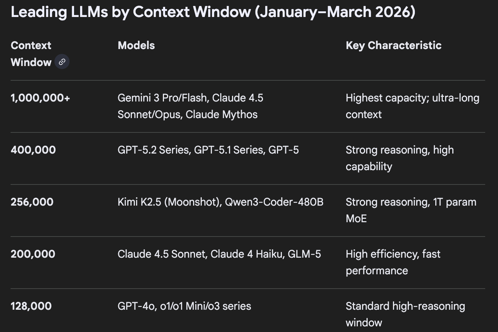
> 200k tokens are roughly two books. 

> Needle in a Haystack Problem: attention mechanisms struggle to focus on very specific facts buried in the middle of a large corpus.

## Two dimensions of LLM enhancement
> **Model Enhancement:** Foundation model improvements gpt-3.5 ->  gpt-4 -> gpt-4o

> Context and Prompts Enhancement: Maximize the performance keeping the same foundation model. Better prompts -> RAG -> Agentic workflows 

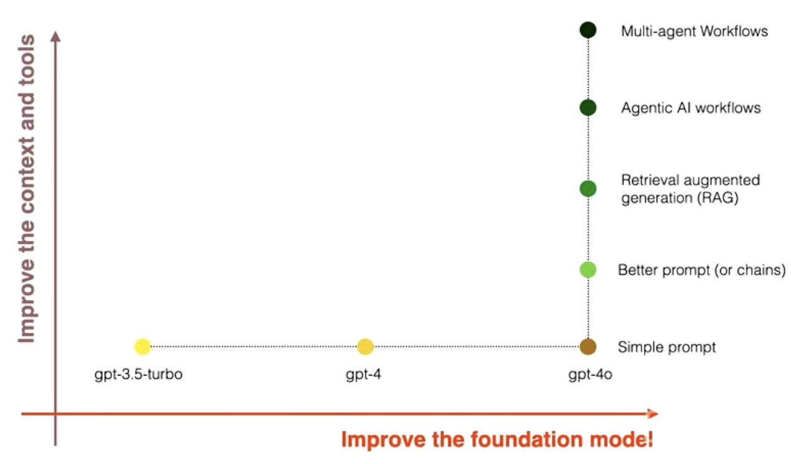

## The Jagged AI Frontier

> **jagged AI frontier**: The nonintuitive strengths and weaknesses of AI performance relative to human performance, and how it is changing over time.

- For each task within the **jagged AI frontier**, consultants using AI were significantly more productive and produced significantly higher quality results.

- For task outside the **jagged AI frontier**, however, consultants using AI were 19 percentage points less likely to produce correct solutions compared to those without AI.
## Are you a Centaur or a Cyborg?
Two principal patterns have been observed in how professionals interact with AI in their daily workflows:
- **Centaurs:** Those who divide and delegate their solution creation activities to the AI. The interaction is more like requesting tasks through entire AI pipelines and reviewing and editing results. (Traditional enterprise non technical roles)
- **Cyborgs:** Those who completely integrate their task flow with the AI and continuously interact with the technology. (e.g Hackers and developers, already technical individuals)

# Prompt Engineering: The First Line of Optimization
## Basic Prompt Design Principles

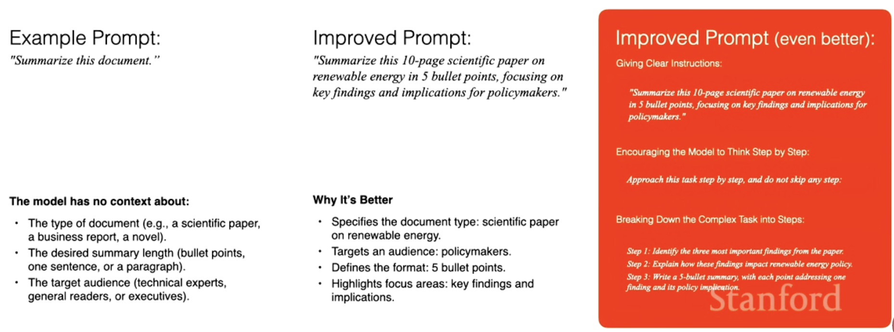
> **Chain of Thought** encourages the model to act following a clear structure and act step by step. It is very popular to control LLMs. Think step by step, step 1, step 2, step 3, do not skip any step.

## Prompt Templates
Prompt templates can be encoded in the code and be scaled for many user requests. Prompt templates can also be used to sanitize user inputs and ensure the structure of the final prompt before passing it to the model.

## Zero Shot vs Few Shot Prompting
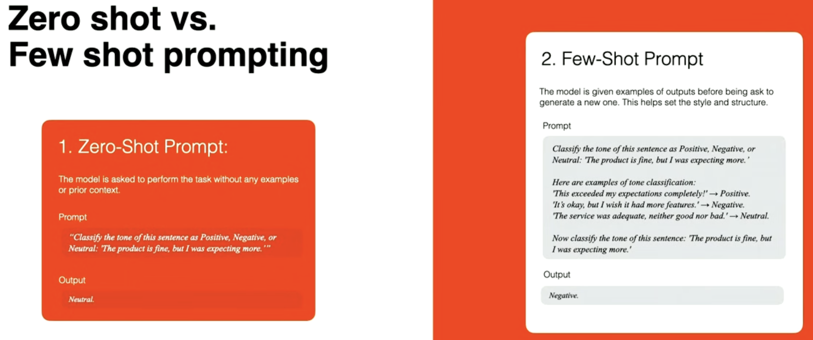

## Chain Complex Prompts for Improved Performance
Instead of building a single big complex prompt, split it into multiple prompts with chained LLM calls; this will allow a higher level of control of the LLM.

> This technique allows to debug and tune each substep of the full complex process.

> This technique can be problematic as it adds latency.

**Complex Prompt (single step)**
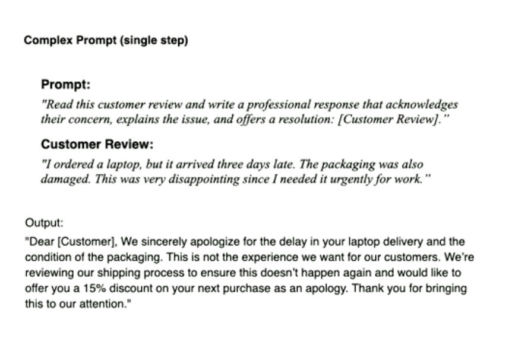

**Complex Prompt (multiple step)**
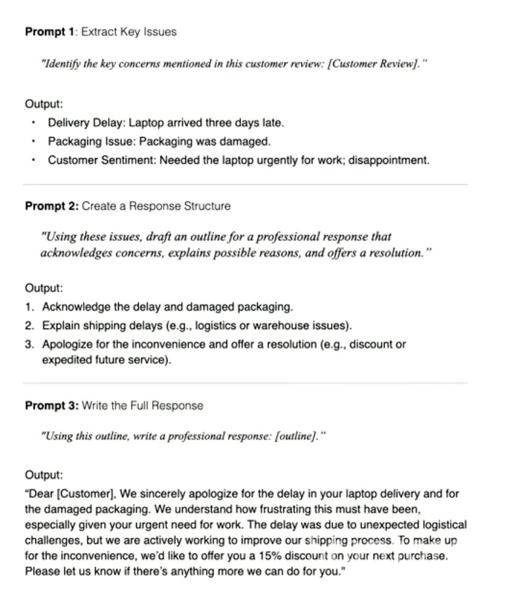

## Testing Your Prompts
**Manual approach**: Score outputs of different prompts using manual review.
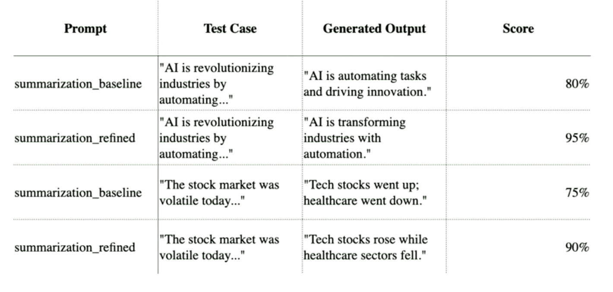

**External Platforms:** Use platforms like [promptfoo](https://www.promptfoo.dev/docs/configuration/parameters/) to automate the review process. It allows you to run the same prompt with different LLMs and list the outputs in an easy way that makes it easy for a human to grade.

**LLM as Judges:** Use LLMs to automatically compare and grade results.
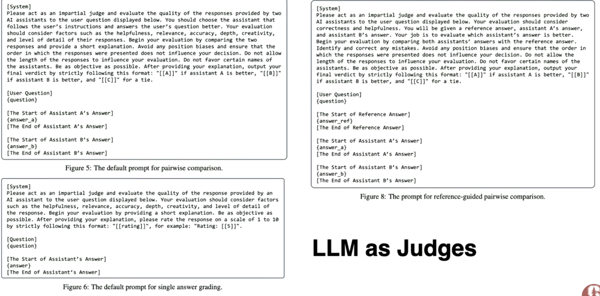

# Fine-Tuning: Proceed with Caution
You have exhausted all the changes to get better results with prompting and you need to actually touch the weights of the model.

Kian says in the lecture that he is not a big fan, for the following reasons:
- Requires substantial labeled data for the fine-tuning task.
- Fine-tuned models may overfit to specific data, losing general-purpose utility.
- Time- and cost-intensive, especially if the base model frequently updates.
# Retrieval-Augmented Generation: Enhancing Model Utility
> There is a debate around the fact that RAG will be meaningful in the future. In theory, with infinite compute, we can have very large context windows so RAG would not be needed for context compression. Nonetheless, even in that case, latency optimization or trustworthy sourcing could be a concern, so RAG can still be a suitable solution.

RAG can help to solve some standalone LLMs gaps:
- Limited context windows.
- Knowledge specific gaps.
- Hallucinations.
- Lack of trustworthy sources.
How:
- Integrates with external knowledge sources (e.g. databases, documents, APIs)
- Ensures answers are more accurate, up-to-date, and grounded.
- More developer control. Allows for targeted customization without retraining the model.
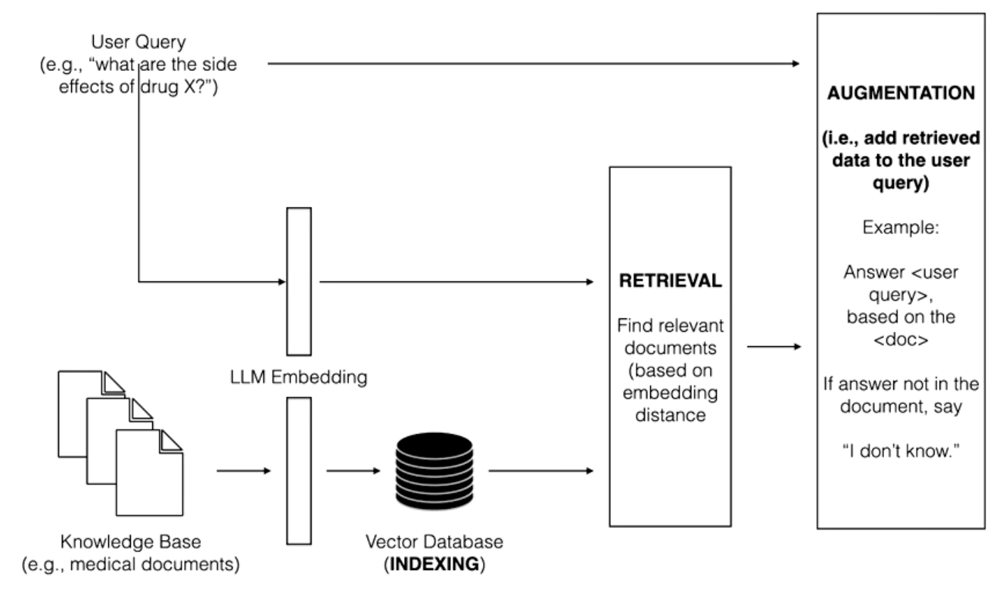

RAG research tree
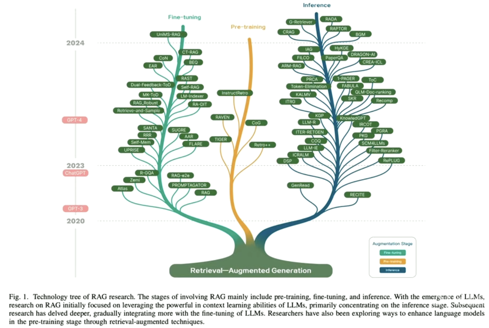
# Agentic AI Workflows: Towards Autonomous and Specialized Systems

An agentic AI workflow is a process where an LLM-based application executes multiple steps to complete a task.

## The AI Paradigm Shift 
Software engineering as a discipline is sort of shifting from a deterministic mindset to a fuzzy mindset, and a balance between the two whenever it is required to design a software solution.

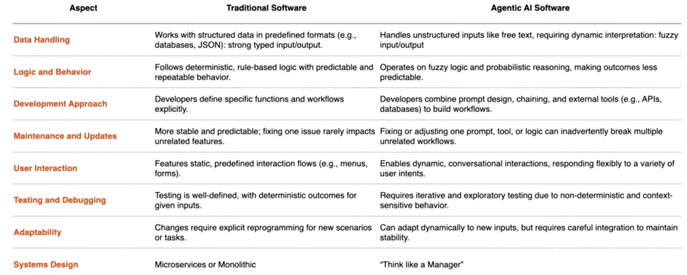

> Find a balance between the fuzzy tasks and deterministic tasks
## Enterprise Workflows are Likely to Change

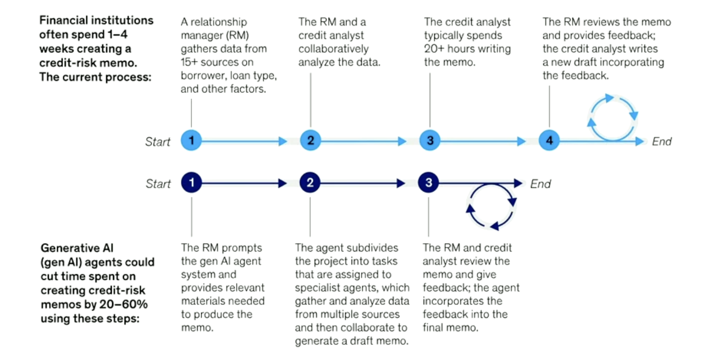

> You are not changing the humans in the process only adding GenAI and reducing the time to get the output and increasing the overall quality of the job.

## Components of an Agent
- Prompts (System Prompt, User Query)
- Context Management System (Core Memory, Archival Memory)
- Tools (APIs, MCPs, Filesystem, cli, other agents)

## Degrees of Autonomy of an Agent
- **Less autonomous:** Hard-coded steps and tools.
- **Semi-autonomous:** Hard-coded tools, agent can decide what to use and when.
- **More autonomous:** Agent decides the steps and can create tools.

## API vs MCP
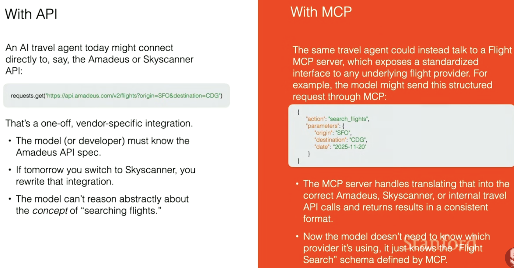

## Travel Agency Agent Example
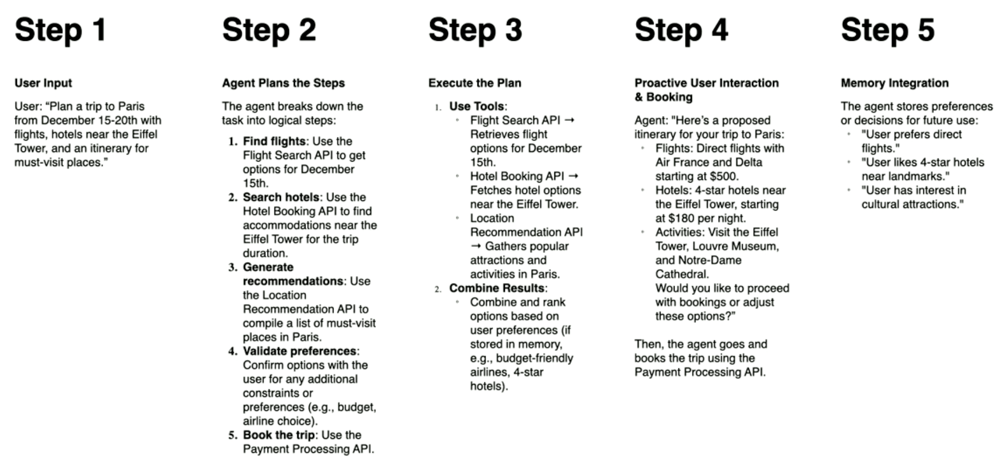
# Evals
LLM evals are tests to check if an Agentic workflow works and how to improve each step of it.

> To debug an LLM system you need to have LLM traces

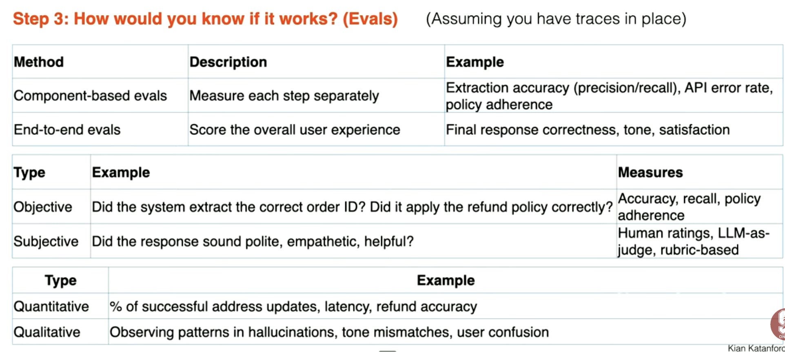
# Multi-Agent Workflows
## Multi-Agent Systems Topologies
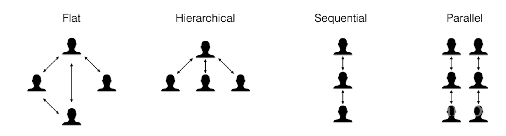
## Multi-Agent vs Single Agent
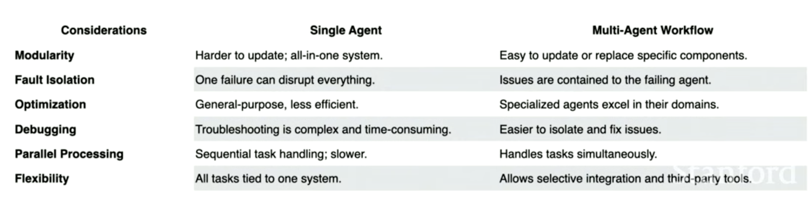

